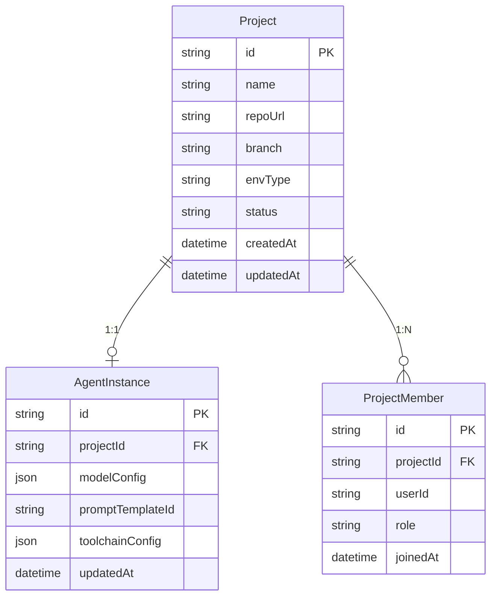
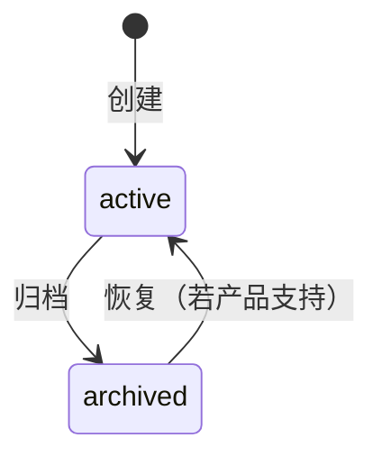

# M1 - 多项目与 Agent 实例管理 · 详细设计

本文档对 **M1 多项目与 Agent 实例管理** 模块进行详细设计，包括业务边界、数据模型、接口定义、状态与流程、权限规则及与上下游的集成方式。依据 [产品设计文档-运维Agent生产系统.md](产品设计文档-运维Agent生产系统.md)、[模块设计文档-运维Agent生产系统.md](模块设计文档-运维Agent生产系统.md)、[产品架构文档-运维Agent生产系统.md](产品架构文档-运维Agent生产系统.md)。

---

## 1. 模块概述

### 1.1 职责边界

- **项目（Project）**：运维项目元数据的全生命周期管理（创建、编辑、归档、删除策略）。
- **Agent 实例（AgentInstance）**：为每个项目绑定唯一 Agent 实例，管理模型配置、Prompt 模板、工具链配置。
- **项目成员与权限（ProjectMember）**：管理项目下成员及其角色（需求方 / Review 方 / 项目管理员），为 BFF 与工作流提供权限校验。
- **配置下发**：为 M2、M4、工作流等提供「按项目隔离」的项目信息与 Agent 配置查询。

### 1.2 不归属 M1 的内容

- 项目下的**知识库内容**（归属 M2/M3）。
- 工单、需求、Review 等**业务数据**（归属各业务模块）。
- **认证**（登录、Token）由统一认证/网关负责，M1 仅做**项目内授权**（是否可访问某项目、某操作）。

---

## 2. 数据模型

### 2.1 ER 关系概览

### 2.2 实体定义

#### 2.2.1 Project（项目）

| 字段 | 类型 | 必填 | 说明 |
|------|------|------|------|
| id | string | 是 | 主键，如 UUID 或雪花 ID |
| name | string | 是 | 项目名称，同租户内建议唯一 |
| description | string | 否 | 项目简介 |
| repoUrl | string | 是 | 代码库地址（如 Git URL） |
| branch | string | 否 | 默认分支，缺省 main/master |
| envType | string | 否 | 环境类型：dev / test / pre / prod，用于展示与策略 |
| status | string | 是 | 状态：active / archived |
| createdAt | datetime | 是 | 创建时间 |
| updatedAt | datetime | 是 | 更新时间 |
| createdBy | string | 否 | 创建人 userId |

**约束**：name 在同一租户/组织下不可重复；归档后仅查询可见，不可新建工单或修改配置。

#### 2.2.2 AgentInstance（Agent 实例）

| 字段 | 类型 | 必填 | 说明 |
|------|------|------|------|
| id | string | 是 | 主键 |
| projectId | string | 是 | 关联项目，唯一 |
| modelConfig | json | 是 | 模型配置，如 {"provider":"openai","model":"gpt-4","temperature":0.2} |
| promptTemplateId | string | 否 | 关联的 Prompt 模板 ID（可来自 Prompt 表或配置中心） |
| toolchainConfig | json | 否 | 工具链配置，如 Linter/测试 类型与参数 |
| updatedAt | datetime | 是 | 更新时间 |

**约束**：一个项目仅一条 AgentInstance；project 删除时级联或软删 AgentInstance。

#### 2.2.3 ProjectMember（项目成员）

| 字段 | 类型 | 必填 | 说明 |
|------|------|------|------|
| id | string | 是 | 主键 |
| projectId | string | 是 | 项目 ID |
| userId | string | 是 | 用户 ID（来自统一认证） |
| role | string | 是 | 角色：demander / reviewer / admin |
| joinedAt | datetime | 是 | 加入时间 |

**约束**：同一 (projectId, userId) 唯一；至少保留一名 admin；demander 可提交需求与查看本人相关工单，reviewer 可 Review，admin 可管理项目与成员、Agent 配置。

#### 2.2.4 PromptTemplate（可选，Prompt 模板）

若模板存库管理，可增加表：

| 字段 | 类型 | 必填 | 说明 |
|------|------|------|------|
| id | string | 是 | 主键 |
| projectId | string | 否 | 为空表示全局模板 |
| name | string | 是 | 模板名称 |
| content | text | 是 | 模板内容（可含占位符） |
| version | int | 是 | 版本号 |
| updatedAt | datetime | 是 | 更新时间 |

---

## 3. 接口设计

### 3.1 项目（Project）

| 方法 | 路径 | 说明 | 权限 |
|------|------|------|------|
| GET | /api/projects | 分页列表，仅返回当前用户有权限的项目 | 已登录 |
| GET | /api/projects/:id | 项目详情 | 项目成员 |
| POST | /api/projects | 创建项目 | 系统管理员或全局创建权限 |
| PUT | /api/projects/:id | 更新项目基本信息 | 项目 admin |
| POST | /api/projects/:id/archive | 归档项目 | 项目 admin |
| GET | /api/projects/:id/agent | 获取项目 Agent 配置（含敏感信息脱敏） | 项目 admin |

**请求/响应示例（创建项目）**：

- 请求：`POST /api/projects`  
  Body: `{ "name": "运维平台", "description": "...", "repoUrl": "https://...", "branch": "main", "envType": "dev" }`
- 响应：`201` Body: `{ "id": "...", "name": "...", ... }`

### 3.2 Agent 实例（AgentInstance）

| 方法 | 路径 | 说明 | 权限 |
|------|------|------|------|
| GET | /api/projects/:projectId/agent | 获取 Agent 配置 | 项目 admin |
| PUT | /api/projects/:projectId/agent | 创建或更新 Agent 配置 | 项目 admin |

**请求/响应示例（更新 Agent）**：

- 请求：`PUT /api/projects/:projectId/agent`  
  Body: `{ "modelConfig": { "provider": "openai", "model": "gpt-4", "temperature": 0.2 }, "promptTemplateId": "...", "toolchainConfig": { ... } }`
- 响应：`200` Body: `{ "id": "...", "projectId": "...", "modelConfig": { ... }, ... }`

### 3.3 项目成员（ProjectMember）

| 方法 | 路径 | 说明 | 权限 |
|------|------|------|------|
| GET | /api/projects/:projectId/members | 成员列表（含角色） | 项目成员 |
| POST | /api/projects/:projectId/members | 添加成员 | 项目 admin |
| PUT | /api/projects/:projectId/members/:userId | 更新成员角色 | 项目 admin |
| DELETE | /api/projects/:projectId/members/:userId | 移除成员 | 项目 admin（不可移除最后一名 admin） |

### 3.4 权限校验（供 BFF/工作流调用）

| 方法 | 路径/用途 | 说明 |
|------|------------|------|
| 内部 | CheckProjectAccess(projectId, userId, action) | action: read / submit_demand / review / manage；返回是否允许 |
| 内部 | ListProjectsByUser(userId) | 返回用户有权限的 projectId 列表或简要信息，供工作台导航 |

---

## 4. 状态与流程

### 4.1 项目状态

- **active**：正常使用，可提交需求、配置 Agent、管理成员。
- **archived**：仅可查看，不可新建工单、不可改配置；列表可筛选「含归档」。

### 4.2 创建项目并初始化 Agent 流程

1. 用户（具备创建权限）提交创建项目表单。
2. 后端校验 name 唯一、必填项，写入 Project，状态 active。
3. 可选：同步创建默认 AgentInstance（默认模型与空工具链），或等用户进入「Agent 配置」再创建。
4. 创建者自动加入 ProjectMember，角色 admin。
5. 返回项目详情，前端可跳转「项目设置」或「知识库维护（M2）」。

---

## 5. 业务规则

- **项目名**：同租户下不可重复；编辑时同样校验。
- **代码库地址**：格式校验（如 URL）；凭证不存 M1，由密钥服务在克隆/拉取时按 projectId 下发。
- **成员**：至少保留 1 名 admin；移除成员时若为最后一名 admin 则拒绝。
- **Agent 实例**：每个项目至多一条；创建项目时可自动创建默认实例，也可首次进入配置页时创建。
- **归档**：归档后不提供「新建需求」入口（由 M2/M4 入口处校验项目 status）。

---

## 6. 与上下游集成

- **M2**：M2 的「项目信息维护」入口依赖 M1 的 ListProjectsByUser、GetProject；仅项目成员可维护该项目的知识库。
- **M4 / 工作流**：需求提交与工作流按 projectId 路由时，调用 CheckProjectAccess、GetAgentConfig；未授权则 403。
- **认证**：BFF 从 Token 解析 userId，所有 M1 接口均带 userId（显式或上下文）；M1 不负责签发 Token。

---

## 7. 页面与功能映射

| 功能 | 页面/入口 | 说明 |
|------|-----------|------|
| 项目列表 | 工作台首页 / 项目管理 | 分页列表、筛选（状态、名称）、进入详情/设置 |
| 创建项目 | 项目列表页「新建项目」 | 表单：名称、描述、仓库地址、分支、环境类型 |
| 项目详情/概览 | 项目详情页 | 基本信息、Agent 状态、知识库就绪状态（来自 M2）、快捷入口 |
| 编辑项目 | 项目设置 · 基本信息 | 编辑名称、描述、仓库、分支、环境类型 |
| Agent 配置 | 项目设置 · Agent 配置 | 模型、Prompt 模板、工具链配置 |
| 成员管理 | 项目设置 · 成员管理 | 列表、添加、改角色、移除 |
| 归档项目 | 项目设置 · 高级 | 归档操作及说明 |

以上页面需遵循 [页面原型风格规范.md](页面原型风格规范.md)，具体原型见 [M1-页面原型说明.md](M1-页面原型说明.md)。
