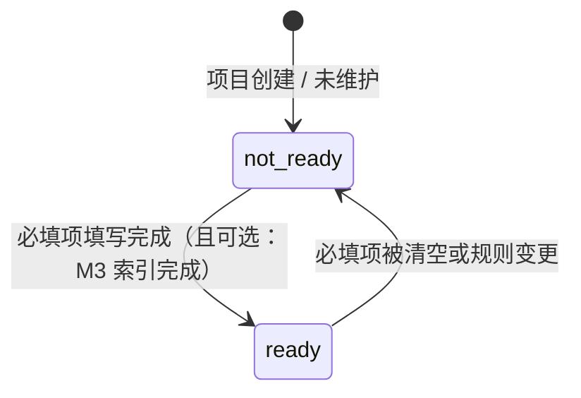

# M2 - 项目信息与知识库前置维护 · 详细设计

本文档对 **M2 项目信息与知识库前置维护** 模块进行详细设计，包括业务边界、数据模型、就绪判定规则、接口定义、与 M1/M3 的集成方式及页面与功能映射。依据 [产品设计文档-运维Agent生产系统.md](产品设计文档-运维Agent生产系统.md)、[模块设计文档-运维Agent生产系统.md](模块设计文档-运维Agent生产系统.md)、[产品架构文档-运维Agent生产系统.md](产品架构文档-运维Agent生产系统.md)。

---

## 1. 模块概述

### 1.1 职责边界

- **项目信息（ProjectProfile）**：按项目维护项目概述、架构/目录说明、关键模块、配置说明、Runbook 等，供 Agent 与知识库使用。
- **知识库就绪（KnowledgeReadiness）**：定义并校验「项目信息就绪」的判定标准（必填项、最小文档集），在需求/Bug 提交入口执行校验，未就绪则拦截并引导先维护。
- **与 M3 协同**：项目信息保存或更新后，调用 M3 写入索引；M3 索引完成后回调或 M2 轮询 M3 状态，更新本模块的就绪状态。
- **配置下发**：为需求提交入口、工作流提供 `RequireKnowledgeReady(projectId)` 等校验接口，保证未就绪项目不可进入分析/设计/修复流程。

### 1.2 不归属 M2 的内容

- **项目元数据**（名称、代码库、分支等）归属 M1；M2 仅维护「项目信息/知识内容」。
- **向量索引、检索、代码索引**归属 M3；M2 只写 M3 的元数据与触发索引，不直接操作向量库。
- **认证与项目内权限**由 M1 负责；M2 接口在「用户已具备项目访问权限」前提下使用。

---

## 2. 数据模型

### 2.1 ER 关系概览

```mermaid
erDiagram
    Project ||--|| ProjectProfile : "1:1"
    Project ||--|| KnowledgeReadiness : "1:1"
    Project {
        string id PK
    }
    ProjectProfile {
        string projectId PK_FK
        text overview
        text architectureDoc
        text directoryDoc
        text configDoc
        text runbookDoc
        datetime updatedAt
    }
    KnowledgeReadiness {
        string projectId PK_FK
        boolean isReady
        json requiredChecks
        datetime lastCheckedAt
    }
```

### 2.2 实体定义

#### 2.2.1 ProjectProfile（项目信息档案）

| 字段 | 类型 | 必填 | 说明 |
|------|------|------|------|
| projectId | string | 是 | 主键，关联 M1 项目 |
| overview | text | 否 | 项目概述（就绪规则中可设为必填） |
| architectureDoc | text | 否 | 架构说明/架构图说明（就绪规则中可设为必填之一） |
| directoryDoc | text | 否 | 目录结构说明（与 architectureDoc 二选一满足即可是常见规则） |
| keyModulesDoc | text | 否 | 关键模块说明 |
| configDoc | text | 否 | 配置说明 |
| runbookDoc | text | 否 | Runbook / 运维手册 |
| updatedAt | datetime | 是 | 最后更新时间 |
| updatedBy | string | 否 | 最后更新人 userId |

**约束**：一个项目仅一条 ProjectProfile；project 归档后仍可查看与编辑项目信息（或按产品策略只读）。

#### 2.2.2 KnowledgeReadiness（知识库就绪状态）

| 字段 | 类型 | 必填 | 说明 |
|------|------|------|------|
| projectId | string | 是 | 主键，关联 M1 项目 |
| isReady | boolean | 是 | 是否就绪，用于需求/Bug 提交前校验 |
| requiredChecks | json | 否 | 本次校验结果快照，如 [{ "item": "overview", "passed": true }, ...] |
| lastCheckedAt | datetime | 是 | 最近一次校验时间 |
| lastIndexedAt | datetime | 否 | M3 最近一次索引完成时间（可选，用于展示） |

**约束**：与 ProjectProfile 一对一；isReady 由就绪规则计算或由 M3 回调更新。

### 2.3 就绪判定规则（配置化）

- **默认规则（示例）**：  
  - 至少包含：**项目概述（overview）** 非空；  
  - 且至少包含：**架构说明（architectureDoc）** 或 **目录结构说明（directoryDoc）** 之一非空。  
- **可选扩展**：必填文档类型列表可配置（如存 DB 或配置中心），如 `["overview", "architectureDoc|directoryDoc"]`，校验逻辑按配置驱动。
- **与 M3 联动（可选）**：若要求「不仅录入且需索引完成」，则 isReady 在 M3 索引任务成功回调后再置为 true；否则仅按「必填字段已填写」即置为就绪。

---

## 3. 接口设计

### 3.1 项目信息（ProjectProfile）

| 方法 | 路径 | 说明 | 权限 |
|------|------|------|------|
| GET | /api/projects/:projectId/profile | 获取项目信息档案 | 项目成员 |
| PUT | /api/projects/:projectId/profile | 创建或更新项目信息（全量/部分字段） | 项目 admin 或具备维护权限的成员 |
| GET | /api/projects/:projectId/profile/readiness | 获取知识库就绪状态与缺失项 | 项目成员 |

**请求/响应示例（更新项目信息）**：

- 请求：`PUT /api/projects/:projectId/profile`  
  Body: `{ "overview": "...", "architectureDoc": "...", "directoryDoc": "...", "keyModulesDoc": "...", "configDoc": "...", "runbookDoc": "..." }`
- 响应：`200` Body: `{ "projectId": "...", "updatedAt": "...", "readiness": { "isReady": true, "missing": [] } }`

**获取就绪状态示例**：

- 请求：`GET /api/projects/:projectId/profile/readiness`
- 响应：`200` Body: `{ "isReady": false, "missing": ["overview"], "requiredChecks": [...], "lastCheckedAt": "..." }`

### 3.2 知识库就绪校验（供需求入口与工作流）

| 方法 | 路径/用途 | 说明 |
|------|------------|------|
| GET | /api/projects/:projectId/profile/require-ready | 需求/Bug 提交前调用：未就绪返回 4xx + 引导文案与 missing 列表；就绪返回 200 | 项目成员 |
| 内部 | RequireKnowledgeReady(projectId) | 供 BFF/工作流调用：未就绪抛错或返回错误码，引导先维护知识库 |

**未就绪时的响应示例**：

- 响应：`409 Conflict` 或 `400`  
  Body: `{ "code": "KNOWLEDGE_NOT_READY", "message": "请先完成项目信息与知识库维护", "missing": ["overview"], "redirectPath": "/projects/:id/knowledge" }`

### 3.3 与 M3 的协同（内部或 BFF 调用）

| 用途 | 说明 |
|------|------|
| 保存 ProjectProfile 后 | 调用 M3.IndexDocument 或批量写入接口，将 overview、architectureDoc 等写入 M3；可选异步队列 |
| 索引完成回调 | M3 索引任务完成后回调 M2 或 M2 轮询 M3 状态，更新 KnowledgeReadiness.isReady 与 lastIndexedAt |
| 仅「必填已填」策略 | 不依赖 M3 回调，在 SaveProjectProfile 时根据就绪规则直接计算并更新 isReady |

---

## 4. 状态与流程

### 4.1 就绪状态



- **not_ready**：需求/Bug 提交入口调用 `RequireKnowledgeReady` 时拦截，返回引导至「项目信息维护」页。
- **ready**：允许进入需求分析/设计/修复流程；工作流创建需求任务前可再次校验。

### 4.2 保存项目信息并更新就绪流程

1. 用户在「项目信息维护」页编辑并提交表单。
2. 后端校验 projectId 归属、权限，写入或更新 ProjectProfile。
3. 根据就绪规则计算当前是否就绪，更新 KnowledgeReadiness（isReady、requiredChecks、lastCheckedAt）。
4. 可选：调用 M3 写入文档/触发索引；若采用「索引完成后才就绪」，则本步仅发任务，就绪状态由 M3 回调或轮询更新。
5. 返回成功及当前 readiness；前端可展示「已就绪」或「还差 xxx 项」。

---

## 5. 业务规则

- **项目信息与项目一一对应**：仅项目成员可查看，仅 admin（或产品约定的角色）可编辑。
- **就绪判定**：以配置的必填项为准；默认至少「项目概述 + 架构或目录说明」已填写。
- **需求/Bug 提交**：入口处必须调用 RequireKnowledgeReady；未就绪时禁止进入分析流程，并引导至 M2 维护页。
- **与 M1 一致**：归档项目的策略（是否允许编辑项目信息）与 M1 项目状态一致或单独约定。

---

## 6. 与上下游集成

- **M1**：依赖 M1 的 GetProject、CheckProjectAccess；仅项目存在且用户有权限时才可访问 M2 接口；项目详情页「知识库」卡片展示就绪状态并链接到 M2 维护页。
- **M3**：ProjectProfile 保存后调用 M3 写入文档/触发索引；可选通过回调或轮询更新 isReady；M2 不直接操作向量库。
- **需求提交入口 / 工作流**：提交需求或工作流创建任务前调用 RequireKnowledgeReady(projectId)，未就绪则拦截并返回 4xx 与 redirectPath。

---

## 7. 页面与功能映射

| 功能 | 页面/入口 | 说明 |
|------|-----------|------|
| 项目信息概览 | 项目信息维护 · 概览 | 展示当前项目 ProjectProfile 摘要、就绪状态、缺失项、编辑入口 |
| 编辑项目信息 | 项目信息维护 · 编辑 | 表单：项目概述、架构说明、目录结构、关键模块、配置说明、Runbook；保存后更新就绪并可选触发 M3 |
| 就绪状态展示 | 项目详情（M1）· 知识库卡片 | 展示是否就绪、「去维护」链接到 M2 概览或编辑页 |
| 未就绪拦截提示 | 需求提交入口 / 工作台 | 调用接口返回 4xx 时，展示「请先完成项目信息与知识库维护」及跳转链接 |

以上页面需遵循 [页面原型风格规范.md](页面原型风格规范.md)，具体原型见 [M2-页面原型说明.md](M2-页面原型说明.md)。
