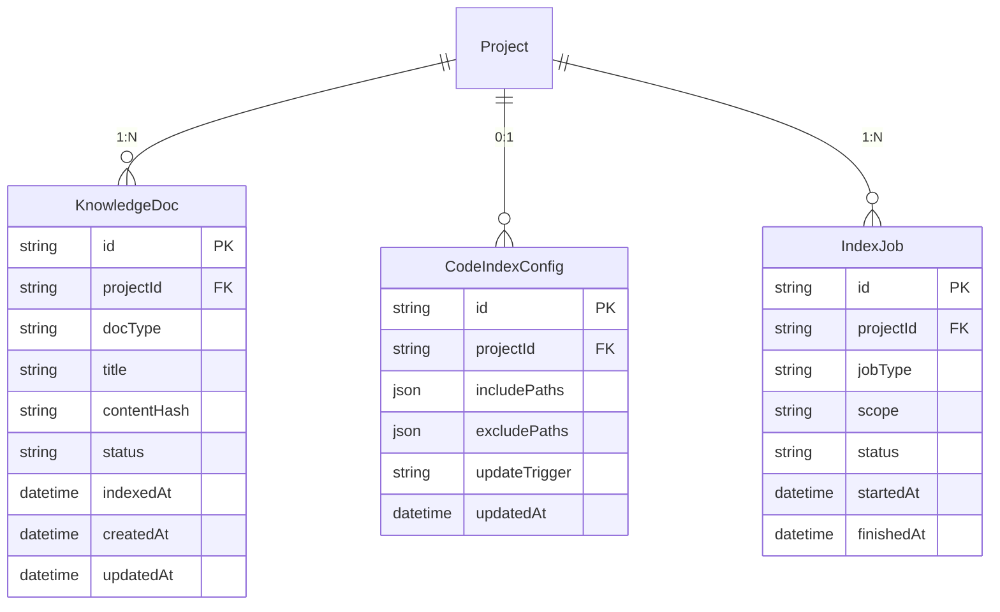
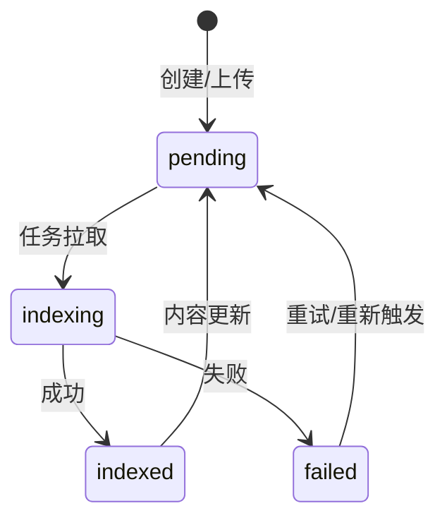
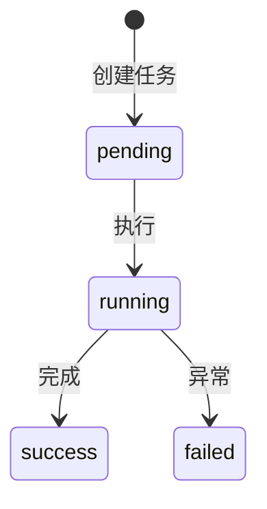

# M3 - 知识库与系统理解增强 · 详细设计

本文档对 **M3 知识库与系统理解增强** 模块进行详细设计，包括业务边界、数据模型、接口定义、索引与检索流程、更新策略及与上下游的集成方式。依据 [产品设计文档-运维Agent生产系统.md](产品设计文档-运维Agent生产系统.md)、[模块设计文档-运维Agent生产系统.md](模块设计文档-运维Agent生产系统.md)、[产品架构文档-运维Agent生产系统.md](产品架构文档-运维Agent生产系统.md)。

---

## 1. 模块概述

### 1.1 职责边界

- **文档知识库**：按项目维护独立知识库，支持项目信息文档、上传文件、Runbook、历史 MR 摘要等的解析、分块、embedding、写入向量库。
- **代码索引**：按项目对代码库关键目录进行 chunk + embedding 或 CodeBERT 类检索，支持增量/全量索引。
- **检索服务（RAG）**：提供按项目维度的语义检索接口，供 M4/M5/M6 等 Agent 拉取上下文。
- **变更反馈写入**：将本次修复/需求摘要回写知识库，便于后续相似需求检索与复用。
- **更新策略**：支持 MR 合并 Webhook 触发、定时任务、手动触发，完成增量或全量索引更新。

### 1.2 不归属 M3 的内容

- **项目信息录入与就绪判定**（归属 M2）；M3 接收 M2 或工作台写入的文档内容并负责索引与检索。
- **需求分类、方案设计、代码生成**（归属 M4/M5/M6/M8）；M3 仅提供检索能力。
- **认证与项目级授权**：由 M1/BFF 负责，M3 接口均带 projectId，按项目隔离数据。

---

## 2. 数据模型

### 2.1 ER 关系概览

### 2.2 实体定义

#### 2.2.1 KnowledgeDoc（知识库文档元数据）

| 字段 | 类型 | 必填 | 说明 |
|------|------|------|------|
| id | string | 是 | 主键 |
| projectId | string | 是 | 项目 ID，来自 M1 |
| docType | string | 是 | 类型：profile / upload / runbook / mr_summary / feedback |
| title | string | 否 | 文档标题或摘要 |
| contentHash | string | 否 | 内容哈希，用于增量判断 |
| status | string | 是 | 状态：pending / indexing / indexed / failed |
| indexedAt | datetime | 否 | 最近一次索引成功时间 |
| createdAt | datetime | 是 | 创建时间 |
| updatedAt | datetime | 是 | 更新时间 |
| meta | json | 否 | 扩展元数据（来源、关联 ticketId 等） |

**约束**：同一 projectId 下 (docType, title 或外部 id) 可唯一；向量库中按 projectId 建 namespace/collection，chunk 与 docId 关联。

#### 2.2.2 CodeIndexConfig（代码索引配置）

| 字段 | 类型 | 必填 | 说明 |
|------|------|------|------|
| id | string | 是 | 主键 |
| projectId | string | 是 | 项目 ID，唯一 |
| includePaths | json | 否 | 包含路径列表，如 ["src/", "lib/"]，空表示全库 |
| excludePaths | json | 否 | 排除路径，如 ["node_modules/", "*.min.js"] |
| updateTrigger | string | 否 | 触发方式：webhook / schedule / manual |
| scheduleCron | string | 否 | 定时任务 cron 表达式 |
| updatedAt | datetime | 是 | 更新时间 |

#### 2.2.3 IndexJob（索引任务）

| 字段 | 类型 | 必填 | 说明 |
|------|------|------|------|
| id | string | 是 | 主键 |
| projectId | string | 是 | 项目 ID |
| jobType | string | 是 | doc / code |
| scope | string | 是 | full / incremental |
| status | string | 是 | pending / running / success / failed |
| startedAt | datetime | 否 | 开始时间 |
| finishedAt | datetime | 否 | 结束时间 |
| message | string | 否 | 失败原因或摘要 |
| stats | json | 否 | 如 { "docCount": 10, "chunkCount": 120 } |

---

## 3. 接口设计

### 3.1 文档与索引

| 方法 | 路径 | 说明 | 权限 |
|------|------|------|------|
| GET | /api/projects/:projectId/knowledge/docs | 分页列表，按类型/状态筛选 | 项目成员 |
| GET | /api/projects/:projectId/knowledge/docs/:docId | 文档元数据及原始内容（若有） | 项目成员 |
| POST | /api/projects/:projectId/knowledge/docs | 创建/上传文档，触发索引 | 项目 admin 或具备维护权限 |
| PUT | /api/projects/:projectId/knowledge/docs/:docId | 更新文档内容，触发重新索引 | 项目 admin 或具备维护权限 |
| DELETE | /api/projects/:projectId/knowledge/docs/:docId | 删除文档并从向量库移除 | 项目 admin 或具备维护权限 |
| POST | /api/projects/:projectId/knowledge/index/trigger | 手动触发索引（body: { jobType, scope }） | 项目 admin |

**请求/响应示例（创建文档）**：

- 请求：`POST /api/projects/:projectId/knowledge/docs`  
  Body: `{ "docType": "upload", "title": "部署手册", "content": "...", "meta": {} }`
- 响应：`201` Body: `{ "id": "...", "projectId": "...", "status": "pending", ... }`

### 3.2 检索

| 方法 | 路径 | 说明 | 权限 |
|------|------|------|------|
| POST | /api/projects/:projectId/knowledge/search | 语义检索（RAG） | 项目成员（或仅后端 Agent 调用） |

**请求/响应示例**：

- 请求：`POST /api/projects/:projectId/knowledge/search`  
  Body: `{ "query": "登录接口在哪里实现的？", "topK": 5, "docTypes": ["profile", "upload", "runbook"] }`
- 响应：`200` Body: `{ "hits": [ { "docId": "...", "score": 0.92, "snippet": "...", "docType": "upload" }, ... ] }`

### 3.3 代码索引配置与任务

| 方法 | 路径 | 说明 | 权限 |
|------|------|------|------|
| GET | /api/projects/:projectId/knowledge/code-config | 获取代码索引配置 | 项目成员 |
| PUT | /api/projects/:projectId/knowledge/code-config | 创建或更新代码索引配置 | 项目 admin |
| GET | /api/projects/:projectId/knowledge/index-jobs | 索引任务列表（分页、按状态筛选） | 项目成员 |
| GET | /api/projects/:projectId/knowledge/index-jobs/:jobId | 任务详情与统计 | 项目成员 |

### 3.4 反馈写入（供 M5/M6/M9 等调用）

| 方法 | 路径 | 说明 | 权限 |
|------|------|------|------|
| POST | /api/projects/:projectId/knowledge/feedback | 将工单摘要写入知识库 | 内部/工作流调用 |

- 请求：`POST /api/projects/:projectId/knowledge/feedback`  
  Body: `{ "ticketId": "...", "summary": "修复了登录超时问题，修改了 auth 模块..." }`
- 响应：`200` Body: `{ "docId": "...", "status": "pending" }`

### 3.5 更新策略配置（可选）

| 方法 | 路径 | 说明 | 权限 |
|------|------|------|------|
| GET | /api/projects/:projectId/knowledge/settings | 获取知识库更新策略等配置 | 项目 admin |
| PUT | /api/projects/:projectId/knowledge/settings | 更新策略（Webhook 开关、定时 cron 等） | 项目 admin |

---

## 4. 状态与流程

### 4.1 文档状态

- **pending**：待索引。
- **indexing**：正在分块、embedding、写入向量库。
- **indexed**：索引成功，可被检索。
- **failed**：索引失败，可查看原因并重试。

### 4.2 索引任务状态

### 4.3 文档索引流水线

1. 用户或 M2 写入/更新文档 → 写入 KnowledgeDoc，status=pending，可选写入队列。
2. 异步 Worker 拉取任务：分块（按配置或默认策略）→ 调用 Embedding 服务 → 写入向量库（按 projectId namespace）→ 更新 KnowledgeDoc.status=indexed、indexedAt。
3. 失败时更新 status=failed，并写入 IndexJob.message 或日志。

### 4.4 代码索引流程

1. 配置 CodeIndexConfig（包含/排除路径）。
2. 触发方式：Webhook（MR 合并）、定时（scheduleCron）、手动（trigger）。
3. 拉取代码库（只读）、按路径过滤、按语言/目录 chunk → embedding → 写入向量库；创建 IndexJob 记录 jobType=code、scope=full/incremental。
4. 增量时仅处理变更文件（依赖 Git 事件或 diff）。

### 4.5 反馈写入流程

1. M5/M6/M9 或工作流在工单完成后调用 AppendFeedback(projectId, ticketId, summary)。
2. M3 生成一条 docType=feedback 的 KnowledgeDoc，content 为 summary，触发索引。
3. 后续 RAG 检索可包含 feedback 类型，便于相似需求命中历史修复/设计摘要。

---

## 5. 业务规则

- **按项目隔离**：所有文档、代码索引、检索均在 projectId 维度隔离；向量库使用 projectId 作为 namespace/collection。
- **检索仅当前项目**：Search(projectId, query, topK) 仅查当前项目，不跨项目。
- **文档类型**：profile 多来自 M2 项目信息；upload 为用户上传；runbook、mr_summary、feedback 由系统或工作流写入。
- **索引触发**：单文档更新可仅对该 doc 重新索引；全量/代码索引建议通过队列异步执行，避免阻塞 API。
- **Embedding 与向量库**：由统一 Embedding 服务与向量库（Qdrant/Milvus/pgvector）承担，M3 调用其接口，不直接持有模型与向量存储。

---

## 6. 与上下游集成

- **M1**：projectId 来自 M1；权限校验由 BFF 调用 M1.CheckProjectAccess，M3 信任 BFF 传入的 projectId。
- **M2**：M2 录入或更新项目信息后调用 M3 IndexDocument（或批量），索引完成后 M3 可回调或 M2 轮询 M3 状态，以更新「知识库就绪」。
- **M4 / M5 / M6**：Agent 在执行需求分类、方案设计、修复方案时调用 M3 Search 获取上下文；接口可为内部调用或经 BFF 转发。
- **M9 / 工作流**：工单测试通过或发布后，可调用 M3 AppendFeedback 写入本次修复/需求摘要。
- **代码库**：代码索引通过只读克隆/拉取访问，凭证由密钥服务按 projectId 下发，M3 不落盘敏感信息。
- **向量库与 Embedding**：依赖统一向量库与 Embedding 服务，按项目可配置模型或 namespace。

---

## 7. 页面与功能映射

| 功能 | 页面/入口 | 说明 |
|------|-----------|------|
| 知识库概览 | 项目下「知识库」主导航 | 文档列表、统计、快捷入口（上传、触发索引） |
| 文档列表 | 知识库 · 文档 | 分页、按类型/状态筛选、上传、编辑、删除、触发索引 |
| 上传/录入文档 | 知识库 · 文档 · 新建 | 表单：类型、标题、内容或文件上传 |
| 文档详情/编辑 | 知识库 · 文档 · 详情 | 查看元数据、内容、索引状态；编辑后重索 |
| 代码索引配置 | 知识库 · 代码索引 | 包含/排除路径、更新触发方式、定时 cron、手动触发 |
| 索引任务列表 | 知识库 · 索引任务 | 任务列表、状态、耗时、统计；失败重试 |
| 检索测试（可选） | 知识库 · 检索测试 | 输入 query、topK，查看命中结果，便于调试 |
| 更新策略配置 | 知识库 · 设置 | Webhook 开关、定时任务配置、默认 doc 类型策略 |

以上页面需遵循 [页面原型风格规范.md](页面原型风格规范.md)，具体原型见 [M3-页面原型说明.md](M3-页面原型说明.md)。
