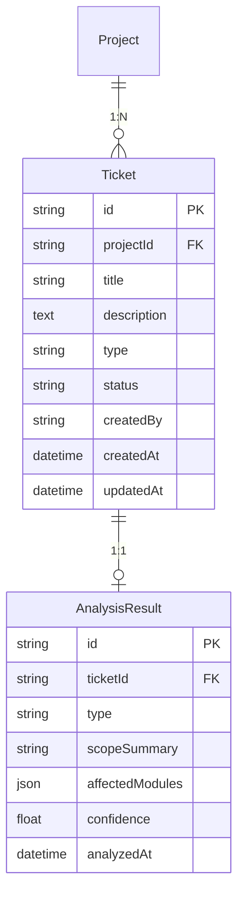
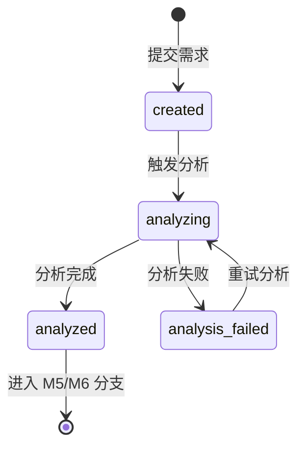

# M4 - 需求理解与分类 · 详细设计

本文档对 **M4 需求理解与分类** 模块进行详细设计，包括业务边界、数据模型、接口定义、状态与流程、业务规则及与上下游的集成方式。依据 [产品设计文档-运维Agent生产系统.md](产品设计文档-运维Agent生产系统.md)、[模块设计文档-运维Agent生产系统.md](模块设计文档-运维Agent生产系统.md)、[产品架构文档-运维Agent生产系统.md](产品架构文档-运维Agent生产系统.md)。

---

## 1. 模块概述

### 1.1 职责边界

- **需求输入**：接收用户在某项目下提交的运维需求文本（标题、描述、可选附件），创建工单（Ticket）并作为分析输入。
- **需求分析与分类**：调用 Agent + 知识库检索（M3），进行意图识别与分类，输出 **Bug** 或 **新需求**，以及结构化分析结果（范围摘要、涉及模块/文件、置信度等）。
- **结果落库与驱动分支**：将分析结果写入工单，驱动工作流按类型分支：Bug → M5 修复流程，新需求 → M6 设计流程；M7 展示工单与后续方案/设计。

### 1.2 不归属 M4 的内容

- **方案/设计生成**（归属 M5/M6）、**人工 Review**（归属 M7）、**代码生成与校验**（归属 M8）、**测试执行**（归属 M9）。
- **知识库内容维护与索引**（归属 M2/M3）；M4 仅消费 M3 的检索接口。
- **项目与 Agent 配置管理**（归属 M1）；M4 仅按 projectId 拉取 Agent 配置并执行分析。
- **认证与登录** 由统一认证/网关负责；M4 接口在 BFF 层校验「项目成员 + 可提交需求」权限。

---

## 2. 数据模型

### 2.1 ER 关系概览

### 2.2 实体定义

#### 2.2.1 Ticket（工单/需求单）

| 字段 | 类型 | 必填 | 说明 |
|------|------|------|------|
| id | string | 是 | 主键，如 UUID 或雪花 ID |
| projectId | string | 是 | 所属项目 ID |
| title | string | 是 | 需求标题 |
| description | text | 否 | 需求描述正文 |
| type | string | 否 | 需求类型：bug / feature，由分析结果回写；创建时可为空 |
| status | string | 是 | 工单状态，见 4.1 节 |
| createdBy | string | 是 | 提交人 userId |
| createdAt | datetime | 是 | 创建时间 |
| updatedAt | datetime | 是 | 更新时间 |
| attachmentUrls | json | 否 | 附件 URL 列表（对象存储路径），可选 |

**约束**：同一项目下工单唯一 id；提交前需通过 M2 的「知识库就绪」校验（由 BFF 或工作流调用）。

#### 2.2.2 AnalysisResult（分析结果）

| 字段 | 类型 | 必填 | 说明 |
|------|------|------|------|
| id | string | 是 | 主键 |
| ticketId | string | 是 | 关联工单，唯一 |
| type | string | 是 | 分类结果：bug / feature |
| scopeSummary | string | 否 | 简要范围描述（自然语言） |
| affectedModules | json | 否 | 涉及模块/文件列表，如 ["module-a", "src/foo.ts"] |
| confidence | float | 否 | 置信度 0～1，可选 |
| rawPayload | json | 否 | Agent 原始输出，便于排查与扩展 |
| analyzedAt | datetime | 是 | 分析完成时间 |

**约束**：一个工单对应一条 AnalysisResult；分析中（status=analyzing）时可能尚未写入或为草稿。

---

## 3. 接口设计

### 3.1 工单（Ticket）

| 方法 | 路径 | 说明 | 权限 |
|------|------|------|------|
| GET | /api/projects/:projectId/tickets | 工单分页列表，支持按状态、类型、关键词筛选 | 项目成员 |
| GET | /api/projects/:projectId/tickets/:ticketId | 工单详情（含分析结果） | 项目成员 |
| POST | /api/projects/:projectId/tickets | 创建工单（提交需求）；可选同步/异步触发分析 | 项目成员（demander 及以上） |
| GET | /api/projects/:projectId/tickets/:ticketId/analysis | 获取分析结果（若已生成） | 项目成员 |

**请求/响应示例（创建工单）**：

- 请求：`POST /api/projects/:projectId/tickets`  
  Body: `{ "title": "登录接口偶发超时", "description": "生产环境用户反馈登录有时超时...", "attachmentUrls": [] }`
- 响应：`201` Body: `{ "id": "...", "projectId": "...", "title": "...", "status": "created", ... }`

**请求/响应示例（工单列表）**：

- 请求：`GET /api/projects/:projectId/tickets?page=1&pageSize=20&status=analyzed&type=bug`
- 响应：`200` Body: `{ "items": [ { "id", "title", "type", "status", "createdAt", ... } ], "total": 100 }`

### 3.2 需求分析（AnalyzeDemand）

| 方法 | 路径 | 说明 | 权限 |
|------|------|------|------|
| POST | /api/projects/:projectId/tickets/:ticketId/analyze | 触发/重新执行需求分析（工作流或用户手动重试） | 项目成员 |

- 请求：`POST /api/projects/:projectId/tickets/:ticketId/analyze`  
  Body: 可选 `{ "force": true }` 表示覆盖已有分析结果
- 响应：`202 Accepted` Body: `{ "jobId": "...", "message": "分析任务已提交" }`（异步）  
  或 `200` Body: `{ "analysisResult": { ... } }`（同步，按实现选一）

### 3.3 内部/工作流调用

| 用途 | 说明 |
|------|------|
| CreateTicket(projectId, input, analysisResult?) | 创建工单并可选写入分析结果；供 BFF 或工作流调用 |
| AnalyzeDemand(projectId, ticketId) | 执行分析，拉取 M1 Agent 配置、M3 检索、LLM 调用，结果写回 Ticket + AnalysisResult |
| GetTicket(ticketId) / GetAnalysisResult(ticketId) | 供 M5、M6、M7 获取工单与分类结果 |

---

## 4. 状态与流程

### 4.1 工单状态

| 状态 | 说明 |
|------|------|
| created | 工单已创建，尚未开始分析或分析任务已排队 |
| analyzing | 分析进行中（Agent + 知识库检索 + LLM 调用） |
| analyzed | 分析完成，type 已写入，可进入 M5（Bug）或 M6（新需求） |
| analysis_failed | 分析失败（如 LLM 超时、检索异常），可重试 |

### 4.2 需求提交与分析流程

1. 用户在项目下填写「需求标题」「需求描述」，可选上传附件；点击「提交」。
2. BFF 校验：项目存在、当前用户为项目成员且具备提交权限、**M2 知识库就绪**（未就绪则 4xx + 引导先维护知识库）。
3. 创建 Ticket，status = created；可选同步调用 AnalyzeDemand 或由工作流异步调起。
4. 若异步：返回 201 + ticketId，前端轮询或 WebSocket 获取状态；分析完成后 status = analyzed，type 与 AnalysisResult 已写入。
5. 若同步：等待分析完成后返回 201 + ticket + analysisResult（超时时间需合理设置）。
6. 分析逻辑：拉取 M1.GetAgentConfig(projectId)、M3.Search(projectId, query)、组装 Prompt 调用 LLM，解析结果为 type + scopeSummary + affectedModules + confidence，写入 AnalysisResult 并更新 Ticket.type、Ticket.status。

### 4.3 与工作流衔接

- 工单创建可由「工作流」的起始节点触发（如：用户提交 → 工作流开始 → 调用 M4.CreateTicket + M4.AnalyzeDemand）。
- 分析完成后，工作流根据 Ticket.type 分支：bug → 调用 M5.GenerateFixPlan；feature → 调用 M6.GenerateDesign。
- M7 展示待审项时，从 M4 获取工单基本信息与 type，从 M5/M6 获取方案/设计内容。

---

## 5. 业务规则

- **知识库就绪**：提交需求前必须通过 M2.CheckKnowledgeReadiness(projectId)；未就绪则拒绝创建工单并提示先完成知识库维护。
- **权限**：仅项目成员可创建、查看工单；列表可按当前用户过滤「我提交的」或查看全部（与角色相关，由 BFF 控制）。
- **分析重试**：status = analysis_failed 时允许「重新分析」，再次调用 AnalyzeDemand；可限制单工单重试次数（如最多 3 次）。
- **类型与下游**：type = bug 仅走 M5，type = feature 仅走 M6；若 Agent 输出异常或低置信度，可落库为「待确认」或由人工选择分支（产品可扩展）。
- **标题与描述**：title 必填；description 建议必填以保证分析质量，前端可做非空校验。

---

## 6. 与上下游集成

- **M1**：按 projectId 拉取 Agent 配置（模型、Prompt 模板、工具链），用于组装分析请求。
- **M2**：需求提交入口调用 RequireKnowledgeReady(projectId)，未就绪则拦截并返回引导文案。
- **M3**：分析时调用 Search(projectId, query)，query 可由 title + description 拼接；检索结果拼入 Prompt 作为上下文。
- **工作流**：工单创建与分析可由工作流节点触发；分析完成后根据 type 触发 M5 或 M6 节点。
- **M5 / M6**：根据 ticketId 读取 Ticket 与 AnalysisResult，作为方案/设计生成的输入。
- **M7**：展示工单列表与详情、类型、状态，以及后续方案/设计/代码的 Review 入口。

---

## 7. 页面与功能映射

| 功能 | 页面/入口 | 说明 |
|------|-----------|------|
| 工单列表 | 项目下「需求」或「工单」Tab / 独立路由 | 分页列表、按状态/类型/关键词筛选、进入详情 |
| 提交需求 | 工单列表页「提交需求」或项目概览快捷入口 | 表单：标题、描述、附件；提交后创建工单并触发分析 |
| 工单详情 | 工单详情页 | 需求内容、分析结果（类型、范围、置信度、涉及模块）、状态、下游入口（进入方案/设计） |
| 重新分析 | 工单详情页（分析失败时） | 按钮「重新分析」，触发 AnalyzeDemand |

以上页面需遵循 [页面原型风格规范.md](页面原型风格规范.md)，具体原型见 [M4-页面原型说明.md](M4-页面原型说明.md)。
