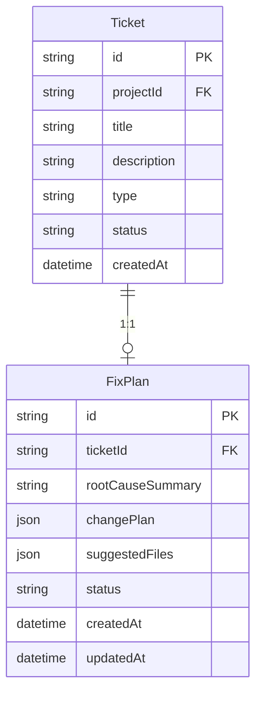
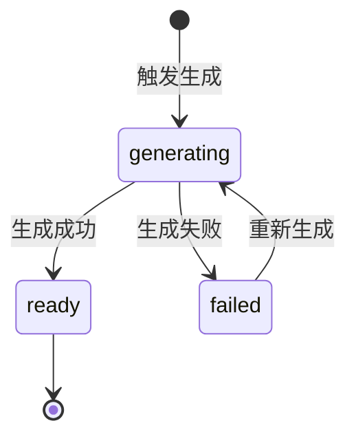

# M5 - Bug 修复流程 · 详细设计

本文档对 **M5 Bug 修复流程** 模块进行详细设计，包括业务边界、数据模型、接口定义、状态与流程、与上下游的集成方式及工作台页面映射。依据 [产品设计文档-运维Agent生产系统.md](产品设计文档-运维Agent生产系统.md)、[模块设计文档-运维Agent生产系统.md](模块设计文档-运维Agent生产系统.md)、[产品架构文档-运维Agent生产系统.md](产品架构文档-运维Agent生产系统.md)。

---

## 1. 模块概述

### 1.1 职责边界

- **问题定位与根因分析**：基于工单（Ticket）与 M4 分析结果，结合 M3 知识库检索与代码库只读上下文，由 Agent 定位 Bug 根因并输出根因摘要。
- **修复方案生成**：生成结构化修复方案（FixPlan），包含变更说明、建议修改的文件/位置，**不直接生成代码**；代码由 M8 在 M7 Review 通过后生成。
- **与工作流衔接**：由工作流在「需求分类完成且类型为 Bug」后触发；方案就绪后进入 M7 人工 Review；Review 通过后由工作流触发 M8 代码生成。

### 1.2 不归属 M5 的内容

- **需求分类与工单创建**（归属 M4）。
- **方案/代码的展示与通过/驳回**（归属 M7 人工 Review 工作台）。
- **代码生成与语法校验**（归属 M8）。
- **测试用例与执行**（归属 M9）。
- **项目与 Agent 配置**（归属 M1）；M5 仅消费 M1 的 Agent 配置与项目隔离信息。

---

## 2. 数据模型

### 2.1 ER 关系概览

- **Ticket** 由 M4 创建并写入分析结果（AnalysisResult）；M5 仅消费与扩展，不拥有 Ticket 实体。
- **FixPlan** 为 M5 核心产出，与 Ticket 一对一；供 M7 展示、M8 消费。

### 2.2 实体定义

#### 2.2.1 FixPlan（修复方案）

| 字段 | 类型 | 必填 | 说明 |
|------|------|------|------|
| id | string | 是 | 主键 |
| ticketId | string | 是 | 关联工单，唯一 |
| projectId | string | 是 | 项目 ID，冗余便于按项目查询 |
| rootCauseSummary | string | 是 | 根因分析摘要（自然语言） |
| changePlan | json | 是 | 变更说明列表，如 [{"description":"...", "file":"path", "lineRange":[start,end]}] |
| suggestedFiles | json | 否 | 建议涉及文件列表，如 ["src/a.js", "test/a.test.js"] |
| status | string | 是 | generating / ready / failed |
| errorMessage | string | 否 | status=failed 时记录失败原因 |
| createdAt | datetime | 是 | 创建时间 |
| updatedAt | datetime | 是 | 更新时间 |
| createdBy | string | 否 | 触发方式：workflow / manual，可选 |

**约束**：一个 Ticket（且 type=bug）至多一条 FixPlan；同一 ticketId 重复触发生成时可覆盖或版本化（由实现决定）。

#### 2.2.2 对 Ticket / AnalysisResult 的依赖（M4 产出）

M5 读取的工单与分析信息包括：

- **Ticket**：id, projectId, title, description, type, status, createdAt 等。
- **AnalysisResult**：ticketId, type（bug/feature）, scopeSummary, affectedModules[], confidence。

M5 不修改 Ticket 的 type；仅在工作流驱动下为 type=bug 的工单生成/更新 FixPlan，并可能更新工单状态（如 plan_ready）由工作流或 BFF 约定。

---

## 3. 接口设计

### 3.1 修复方案（FixPlan）

| 方法 | 路径 | 说明 | 权限 |
|------|------|------|------|
| POST | /api/projects/:projectId/tickets/:ticketId/fix-plan/generate | 触发生成修复方案（同步入参，异步执行时返回 taskId） | 项目成员（demander/reviewer/admin） |
| GET | /api/projects/:projectId/tickets/:ticketId/fix-plan | 获取当前工单的修复方案 | 项目成员 |
| GET | /api/projects/:projectId/bugs | 分页列表：仅 type=bug 的工单，支持状态筛选 | 项目成员 |

**请求/响应示例（触发生成）**：

- 请求：`POST /api/projects/:projectId/tickets/:ticketId/fix-plan/generate`  
  Body: `{}` 或空
- 响应（异步）：`202 Accepted` Body: `{ "taskId": "...", "message": "修复方案生成已提交" }`
- 响应（同步超时前完成）：`200` Body: `{ "id": "...", "ticketId": "...", "rootCauseSummary": "...", "changePlan": [...], "status": "ready" }`

**请求/响应示例（获取方案）**：

- 请求：`GET /api/projects/:projectId/tickets/:ticketId/fix-plan`
- 响应：`200` Body: `{ "id": "...", "ticketId": "...", "rootCauseSummary": "...", "changePlan": [...], "suggestedFiles": [...], "status": "ready", "createdAt": "...", "updatedAt": "..." }`
- 若未生成或生成中：`200` Body: `{ "status": "generating" }` 或 `404`（由实现约定）

### 3.2 与工作流联动（内部）

| 用途 | 说明 |
|------|------|
| 工作流触发 | 工作流在「M4 分析完成且 type=bug」后调用 M5 的 GenerateFixPlan(ticketId)；可异步入队，Worker 消费后调用 Agent 并写回 FixPlan |
| 状态回写 | M5 将 FixPlan.status 更新为 ready 或 failed 后，由工作流轮询或事件驱动进入 M7「待 Review」节点 |

---

## 4. 状态与流程

### 4.1 FixPlan 状态

- **generating**：Agent 正在执行根因分析与方案生成；前端可展示 Loading 或进度提示。
- **ready**：方案已落库，可供 M7 展示与 Review；M8 在 Review 通过后消费。
- **failed**：生成失败（如 LLM 超时、检索异常）；可展示 errorMessage，支持「重新生成」。

### 4.2 Bug 修复主流程（M5 段）

1. 用户提交需求 → M4 分析 → 分类为 Bug，创建/更新 Ticket 与 AnalysisResult。
2. 工作流根据 type=bug 触发 M5：调用 GenerateFixPlan(ticketId)（同步或异步）。
3. M5 拉取工单与 M4 分析结果，调用 M3.Search(projectId, query) 与代码库只读上下文，由 Agent 生成 rootCauseSummary、changePlan、suggestedFiles，写入 FixPlan，status=ready。
4. 若失败则 status=failed，写 errorMessage；工作流可重试或进入「需人工处理」分支。
5. 方案就绪后，工作流创建 M7 的「方案 Review」任务；用户在工作台查看 FixPlan 并完成 Review。
6. Review 通过后，工作流触发 M8 代码生成（输入 FixPlan）；M5 不再参与后续环节。

---

## 5. 业务规则

- **入口校验**：仅当 Ticket.type=bug 时允许生成 FixPlan；非 Bug 工单调用生成接口应返回 400 或明确错误提示。
- **项目与权限**：所有接口按 projectId 隔离；调用方须具备该项目成员身份（由 M1 或 BFF 校验）。
- **知识库就绪**：建议在 M4 需求提交入口已做知识库就绪校验（M2）；M5 执行时若发现项目知识库未就绪，可记录失败原因并置 status=failed。
- **幂等与重试**：同一 ticketId 重复触发生成时，可由实现决定覆盖原 FixPlan 或生成新版本；重试时清空原 failed 状态再置为 generating。
- **输出约束**：FixPlan 仅输出结构化文档与建议文件列表，不包含可执行代码；代码由 M8 生成。

---

## 6. 与上下游集成

- **M4**：消费 Ticket 与 AnalysisResult；不修改 M4 数据。工单由 M4 创建，M5 仅读写 FixPlan 及可选工单状态字段（若约定由 M5 更新 plan_ready）。
- **M3**：调用 Search(projectId, query) 获取知识库与代码索引检索结果，作为 Agent 上下文。
- **M1**：获取 GetAgentConfig(projectId)、GetProject(projectId)，用于加载 Prompt 与模型配置；不写 M1。
- **M7**：M7 通过 GetFixPlan 或 BFF 聚合获取 FixPlan 内容，展示在 Review 工作台；M5 不直接调用 M7。
- **M8**：M8 在 Review 通过后由工作流触发生成代码，输入为 FixPlan；M5 不直接调用 M8。
- **工作流**：M5 由工作流在「分析完成且 type=bug」节点触发；FixPlan 就绪或失败后，由工作流推进到 M7 或重试/人工处理节点。

---

## 7. 页面与功能映射

| 功能 | 页面/入口 | 说明 |
|------|-----------|------|
| Bug 工单列表 | 工作台 · Bug 工单 / 项目下 Bug 列表 | 分页列表、按项目/状态筛选、进入详情 |
| Bug 工单详情 | Bug 工单详情页 | 工单信息、M4 分析结果、修复方案状态与入口 |
| 修复方案查看/触发生成 | 修复方案页（或工单详情内 Tab） | 查看 FixPlan（根因、变更说明、建议文件）、触发生成、重新生成 |
| 方案 Review | M7 工作台 | 待审项含 FixPlan，通过/驳回；见 M7 设计 |

以上页面需遵循 [页面原型风格规范.md](页面原型风格规范.md)，具体原型见 [M5-页面原型说明.md](M5-页面原型说明.md)。
