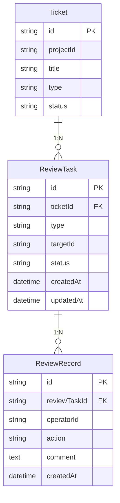
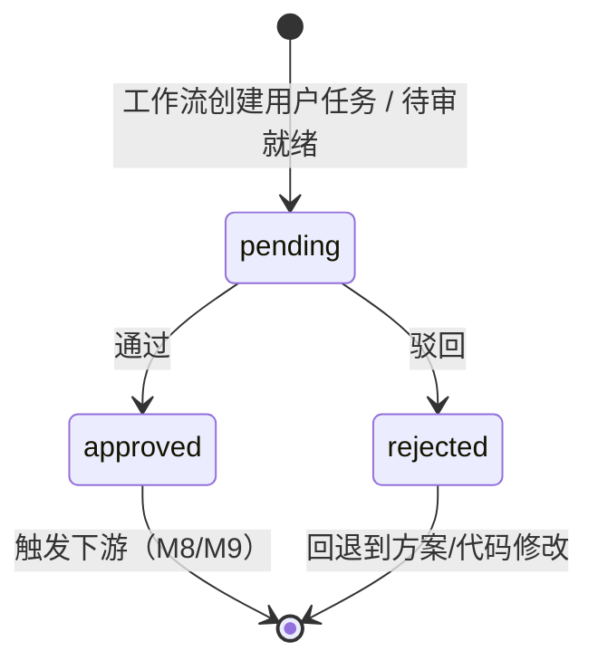

# M7 - 人工 Review 工作台 · 详细设计

本文档对 **M7 人工 Review 工作台** 模块进行详细设计，包括业务边界、数据模型、接口定义、状态与流程、权限规则及与上下游的集成方式。依据 [产品设计文档-运维Agent生产系统.md](产品设计文档-运维Agent生产系统.md)、[模块设计文档-运维Agent生产系统.md](模块设计文档-运维Agent生产系统.md)、[产品架构文档-运维Agent生产系统.md](产品架构文档-运维Agent生产系统.md)。

---

## 1. 模块概述

### 1.1 职责边界

- **待审项汇总**：从 M5/M6（方案）、M8（代码变更与 Lint 结果）、M9（测试报告）拉取待 Review 内容，按工单维度展示给 Review 方。
- **通过/驳回操作**：Review 方对待审项执行通过或驳回；驳回时必填意见，并回退到对应环节（方案修改或代码修改）。
- **审计日志**：记录每次操作的操作人、时间、动作（通过/驳回）、意见，写入 ReviewRecord，不可篡改、只追加。
- **工作流衔接**：待审项对应工作流中的「用户任务」或「信号」节点；完成 Review 后驱动工作流推进（触发 M8 代码生成或 M9 执行）或回退。

### 1.2 不归属 M7 的内容

- **方案/设计/代码/测试报告的内容生产**（归属 M5、M6、M8、M9）；M7 仅展示与操作（通过/驳回）。
- **项目与成员管理、权限中心**（归属 M1）；M7 依赖 M1 的 reviewer/admin 角色做接口级校验。
- **工作流引擎的节点定义与调度**（归属编排层）；M7 通过 BFF 或内部接口完成「用户任务」并回传结果。

---

## 2. 数据模型

### 2.1 ER 关系概览

### 2.2 实体定义

#### 2.2.1 ReviewTask（待审任务）

| 字段 | 类型 | 必填 | 说明 |
|------|------|------|------|
| id | string | 是 | 主键 |
| ticketId | string | 是 | 关联工单 ID |
| projectId | string | 是 | 项目 ID，用于权限与筛选 |
| type | string | 是 | 待审类型：plan / code / testReport |
| targetId | string | 是 | 关联目标 ID（FixPlan/DesignDoc 的 id、CodeChange 的 id、TestRun 的 id） |
| status | string | 是 | pending / approved / rejected |
| workflowTaskId | string | 否 | 工作流用户任务 ID，用于回调完成/传参 |
| createdAt | datetime | 是 | 创建时间（待审就绪时间） |
| updatedAt | datetime | 是 | 更新时间 |

**约束**：同一 (ticketId, type) 在 pending 状态下仅一条；approved/rejected 后可由工作流或下游再次产生新的一轮 ReviewTask（如代码修改后再次提交 Review）。

**type 说明**：

- **plan**：方案 Review，目标为 FixPlan（Bug）或 DesignDoc（新需求）。
- **code**：代码 Review，目标为 CodeChange，可附带 LinterResult 展示。
- **testReport**：测试报告 Review（可选），目标为 TestRun/TestReport，用于二次确认测试结果后再发布。

#### 2.2.2 ReviewRecord（审计记录）

| 字段 | 类型 | 必填 | 说明 |
|------|------|------|------|
| id | string | 是 | 主键 |
| reviewTaskId | string | 是 | 关联 ReviewTask |
| ticketId | string | 是 | 工单 ID，便于按工单查历史 |
| operatorId | string | 是 | 操作人 userId |
| action | string | 是 | approve / reject |
| comment | text | 否 | 意见；驳回时必填，通过时可选 |
| createdAt | datetime | 是 | 操作时间 |

**约束**：仅追加，不修改、不删除；用于审计与「工单 Review 历史」展示。

---

## 3. 接口设计

### 3.1 待审列表与详情

| 方法 | 路径 | 说明 | 权限 |
|------|------|------|------|
| GET | /api/reviews/pending | 待审列表，支持 projectId、type、分页 | reviewer / admin |
| GET | /api/reviews/tasks/:id | 单条待审任务详情（含 BFF 聚合的展示内容） | 项目 reviewer/admin |
| GET | /api/reviews/tasks/:id/content | 待审内容体（方案正文/代码 diff/测试报告摘要），按 type 返回不同结构 | 项目 reviewer/admin |

**请求/响应示例（待审列表）**：

- 请求：`GET /api/reviews/pending?projectId=xxx&type=plan&page=1&pageSize=20`
- 响应：`200` Body: `{ "items": [ { "id", "ticketId", "projectId", "type", "status", "ticketTitle", "createdAt", "targetId" } ], "total": 100 } `

### 3.2 提交 Review

| 方法 | 路径 | 说明 | 权限 |
|------|------|------|------|
| POST | /api/reviews/tasks/:id/submit | 提交通过或驳回 | 项目 reviewer/admin |

**请求体**：

- `{ "action": "approve" | "reject", "comment": "可选，驳回时必填" }`

**响应**：`200` 成功；驳回时校验 comment 非空；成功后由 BFF 或后端回调工作流完成用户任务并传参（如 action、comment），驱动下一节点或回退。

### 3.3 Review 历史

| 方法 | 路径 | 说明 | 权限 |
|------|------|------|------|
| GET | /api/reviews/history?ticketId=xxx | 某工单的 Review 历史（按时间倒序） | 项目成员 |

**响应**：`200` Body: `{ "items": [ { "id", "reviewTaskId", "ticketId", "type", "operatorId", "operatorName", "action", "comment", "createdAt" } ] }`

### 3.4 权限校验（依赖 M1）

- 仅 **reviewer**、**admin** 可调用「待审列表」「提交 Review」；列表可按当前用户可见项目过滤（ListProjectsByUser + projectId 过滤）。
- 需求方（demander）仅可查看本人相关工单的进度，是否可看「Review 历史」由产品决定（建议可读，便于知晓驳回原因）。

---

## 4. 状态与流程

### 4.1 ReviewTask 状态

- **pending**：待 Review 方处理。
- **approved**：已通过，工作流推进；若为 plan 则触发 M8 代码生成，若为 code 则可能触发 M9 测试或发布。
- **rejected**：已驳回，工作流回退；需求方/Agent 根据意见修改后重新走流程，生成新的 ReviewTask。

### 4.2 与工作流的衔接

- 工作流在「方案就绪」「代码就绪」「测试报告就绪」等节点创建 **用户任务**（Human Task），并创建或更新 **ReviewTask**（status=pending）。
- 前端「提交 Review」调用 BFF → M7 写入 ReviewRecord、更新 ReviewTask.status；M7 或 BFF 再回调工作流引擎完成该用户任务，并传入 `action`、`comment`。
- 工作流根据 action 决定下一节点：approve → 下一环节（如 M8/M9）；reject → 回退到指定节点（如方案修改、代码修改）。

---

## 5. 业务规则

- **驳回必填意见**：action=reject 时，comment 必填，否则接口返回 400。
- **仅 pending 可操作**：仅 status=pending 的 ReviewTask 可提交通过/驳回；已 approved/rejected 的不可再次提交。
- **权限**：仅项目内 reviewer/admin 可看到待审列表并提交 Review；列表默认按当前用户有权限的项目过滤。
- **审计不可篡改**：ReviewRecord 只追加不修改不删除；查询历史时按 ticketId 或 reviewTaskId 返回。

---

## 6. 与上下游集成

- **M1**：校验当前用户是否为项目 reviewer/admin；待审列表按 projectId 过滤时使用 ListProjectsByUser。
- **M5/M6**：待审类型为 plan 时，展示内容来自 FixPlan 或 DesignDoc（BFF 聚合或 M7 调 M5/M6 读接口）。
- **M8**：待审类型为 code 时，展示内容为 CodeChange + LinterResult（BFF 聚合或 M7 调 M8 读接口）。
- **M9**：待审类型为 testReport 时，展示内容为 TestReport 摘要（BFF 聚合或 M7 调 M9 读接口）。
- **工作流引擎**：M7 在 SubmitReview 成功后回调完成用户任务并传参，由工作流推进或回退；待审项的创建由工作流或上游模块在就绪时写入 ReviewTask。

---

## 7. 页面与功能映射

| 功能 | 页面/入口 | 说明 |
|------|-----------|------|
| 待审列表 | Review 工作台 · 待审列表 | 分页列表、按项目/类型筛选、进入详情 |
| 方案 Review | Review 详情（type=plan） | 展示 FixPlan/DesignDoc 内容，通过/驳回表单 |
| 代码 Review | Review 详情（type=code） | 展示代码变更与 Lint 结果，通过/驳回表单 |
| 测试报告 Review | Review 详情（type=testReport） | 展示测试报告摘要，通过/驳回（可选） |
| Review 历史 | 工单维度 / 详情页内区块 | 展示该工单下所有 ReviewRecord，谁、何时、通过/驳回及意见 |

以上页面需遵循 [页面原型风格规范.md](页面原型风格规范.md)，具体原型见 [M7-页面原型说明.md](M7-页面原型说明.md)。
