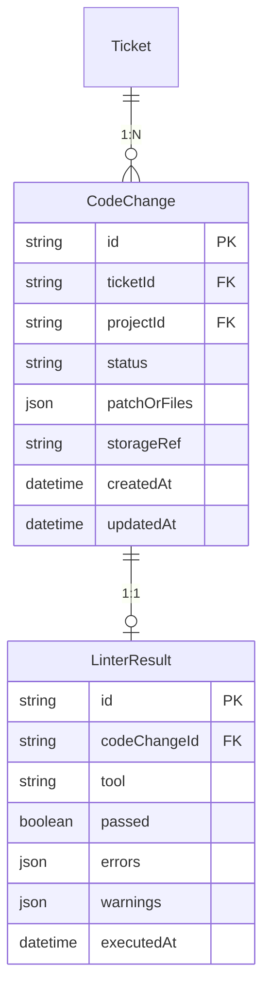
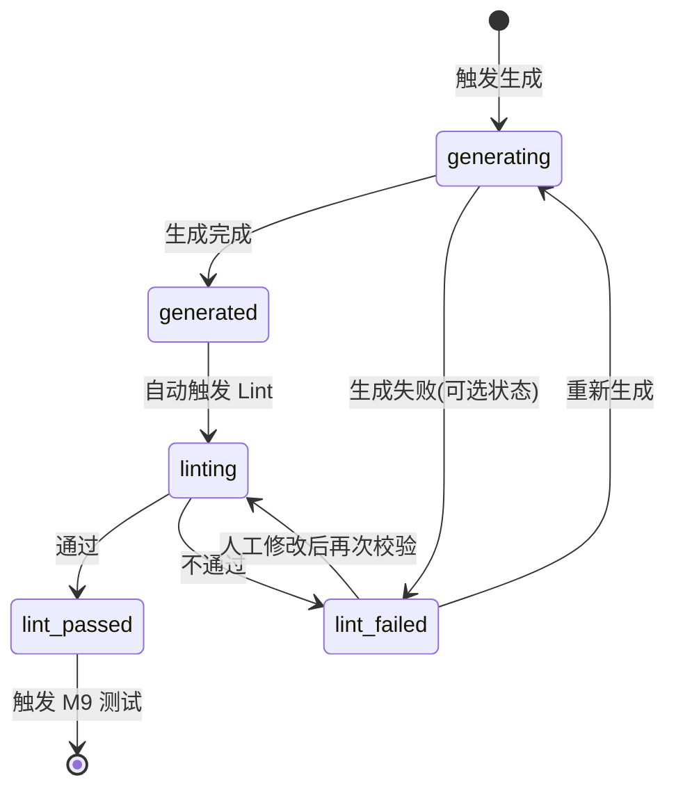

# M8 - 代码生成与语法校验 · 详细设计

本文档对 **M8 代码生成与语法校验** 模块进行详细设计，包括业务边界、数据模型、接口定义、状态与流程、权限规则及与上下游的集成方式。依据 [产品设计文档-运维Agent生产系统.md](产品设计文档-运维Agent生产系统.md)、[模块设计文档-运维Agent生产系统.md](模块设计文档-运维Agent生产系统.md)、[产品架构文档-运维Agent生产系统.md](产品架构文档-运维Agent生产系统.md)。

---

## 1. 模块概述

### 1.1 职责边界

- **代码生成**：在方案/设计 Review 通过后，根据 FixPlan（Bug 修复）或 DesignDoc（新需求）调用 Agent + LLM 生成代码（补丁或新文件），结果先落临时目录或内存，不直接推送代码库。
- **语法/静态检查**：对生成结果调用项目配置的 Linter（如 ESLint、Pylint、go vet），解析输出为标准结构（行号、消息、严重级别）；检查不通过时产出可读结果，支持重新生成或人工修改后再次校验。
- **结果落库与下游触发**：检查通过后将 CodeChange、LinterResult 落库，并触发 M9 测试；同时将代码与检查结果提供给 M7 作为代码 Review 对象。

### 1.2 不归属 M8 的内容

- **方案/设计产出**（归属 M5/M6）。
- **人工 Review 流程与待审任务**（归属 M7）；M8 仅在「Review 通过」后被工作流触发。
- **测试用例生成与执行**（归属 M9）；M8 只负责「代码 + Lint 通过」后触发 M9，不包含测试逻辑。
- **项目与 Agent 配置**（归属 M1）；M8 仅消费项目与工具链配置（如 Linter 类型、参数）。

---

## 2. 数据模型

### 2.1 ER 关系概览

### 2.2 实体定义

#### 2.2.1 CodeChange（代码变更）

| 字段 | 类型 | 必填 | 说明 |
|------|------|------|------|
| id | string | 是 | 主键 |
| ticketId | string | 是 | 关联工单 |
| projectId | string | 是 | 关联项目，便于按项目筛选与权限 |
| status | string | 是 | 状态：pending / generating / generated / linting / lint_passed / lint_failed |
| patchOrFiles | json | 否 | 变更内容：patch 文本或文件路径与内容列表；大体积可仅存引用 |
| storageRef | string | 否 | 若 patch 存对象存储，此处为对象 key 或 URL |
| version | int | 是 | 同一工单下代码变更的版本号，重新生成时递增 |
| createdAt | datetime | 是 | 创建时间 |
| updatedAt | datetime | 是 | 更新时间 |
| generatedAt | datetime | 否 | 代码生成完成时间 |
| triggeredBy | string | 否 | 触发方式：workflow / manual_retry |

**约束**：同一 ticketId 下可存在多条 CodeChange（历次生成），取最新 version 或 status 为 lint_passed 的一条作为「当前有效」；业务上可约定「仅保留最新 N 版」或全部保留便于追溯。

#### 2.2.2 LinterResult（检查结果）

| 字段 | 类型 | 必填 | 说明 |
|------|------|------|------|
| id | string | 是 | 主键 |
| codeChangeId | string | 是 | 关联代码变更 |
| tool | string | 是 | 使用的工具，如 eslint、pylint、go vet |
| passed | boolean | 是 | 是否通过 |
| errors | json | 是 | 错误列表，如 [{ "file", "line", "message", "severity" }] |
| warnings | json | 是 | 警告列表，结构同 errors；可选按项目配置决定是否阻挡通过 |
| executedAt | datetime | 是 | 执行时间 |
| rawOutput | string | 否 | 原始命令行输出，便于排查 |

**约束**：一个 CodeChange 对应一次 Linter 执行，重新校验时可覆盖或新增一条 LinterResult（由实现决定）；查询时取最新一次即可。

---

## 3. 接口设计

### 3.1 代码生成（供工作流与前端调用）

| 方法 | 路径 | 说明 | 权限 |
|------|------|------|------|
| POST | /api/tickets/:ticketId/code/generate | 触发生成代码（工作流或用户「重新生成」） | 项目成员；且工单已方案 Review 通过 |
| GET | /api/tickets/:ticketId/code | 获取该工单当前/最新代码变更（含 Linter 结果） | 项目成员 |
| GET | /api/tickets/:ticketId/code/changes | 获取该工单所有代码变更历史（分页可选） | 项目成员 |

**请求/响应示例（触发生成）**：

- 请求：`POST /api/tickets/:ticketId/code/generate`  
  Body: `{}` 或 `{ "triggeredBy": "manual_retry" }`
- 响应：`202 Accepted` Body: `{ "codeChangeId": "...", "status": "generating" }`；或同步完成时 `200` Body: `{ "codeChangeId": "...", "status": "generated" }`

### 3.2 语法/静态检查

| 方法 | 路径 | 说明 | 权限 |
|------|------|------|------|
| POST | /api/tickets/:ticketId/code/:codeChangeId/lint | 对指定代码变更执行 Linter | 项目成员 |
| GET | /api/tickets/:ticketId/code/:codeChangeId/lint | 获取该次代码变更的 Linter 结果 | 项目成员 |

**响应示例（Linter 结果）**：

- `200` Body: `{ "id": "...", "codeChangeId": "...", "tool": "eslint", "passed": false, "errors": [{ "file": "src/foo.js", "line": 10, "message": "Unexpected var.", "severity": "error" }], "warnings": [], "executedAt": "..." }`

### 3.3 代码与校验列表（工作台）

| 方法 | 路径 | 说明 | 权限 |
|------|------|------|------|
| GET | /api/projects/:projectId/code-changes | 按项目分页查询代码变更列表（用于「代码与校验」工作台） | 项目成员 |

**查询参数**：ticketId、status（generating / generated / linting / lint_passed / lint_failed）、page、pageSize。

**响应**：`{ "items": [ { "id", "ticketId", "ticketTitle", "status", "version", "linterPassed", "createdAt" } ], "total": N }`

### 3.4 权限与前置校验

- 所有接口需校验用户为项目成员（依赖 M1 CheckProjectAccess）。
- 触发生成前需校验：工单已存在、方案/设计已 Review 通过（可由工作流保证或接口内查 M7 状态）。
- 再次校验（RunLinter）：仅当存在已生成的 CodeChange 时可调用。

---

## 4. 状态与流程

### 4.1 代码变更状态

- **pending**：已创建记录，尚未开始生成（可选，部分实现可能直接进入 generating）。
- **generating**：Agent/LLM 正在生成代码。
- **generated**：代码已生成，待执行 Linter。
- **linting**：正在执行 Linter。
- **lint_passed**：Linter 通过，可触发 M9；M7 可展示供代码 Review。
- **lint_failed**：Linter 不通过，展示错误列表，支持重新生成或再次校验。

### 4.2 典型流程

1. **工作流触发**：M7 方案/代码 Review 通过 → 工作流调用 `POST /api/tickets/:ticketId/code/generate`。
2. **生成**：M8 拉取 FixPlan/DesignDoc、调用 Agent+LLM 生成 patch 或文件，写入 CodeChange（status=generated），落临时目录或对象存储。
3. **Lint**：生成完成后自动调用 `RunLinter`（或同流程内顺序执行），写入 LinterResult；更新 CodeChange.status 为 lint_passed 或 lint_failed。
4. **不通过**：前端/工作台展示错误列表；用户可选择「重新生成」或「人工修改后再次校验」；再次校验即对当前 CodeChange 再次调用 Linter（若支持上传修改后内容则需额外接口）。
5. **通过**：status 更新为 lint_passed，工作流触发 M9 测试；M7 可展示代码与 Lint 结果供二次 Review（若产品需要）。

---

## 5. 业务规则

- **触发条件**：仅当工单对应方案或设计已「Review 通过」时允许触发生成；由工作流或接口内校验 M7 状态保证。
- **Linter 配置**：按项目从 M1 Agent 的 toolchainConfig 或独立「Linter 配置」读取（如工具类型、配置文件路径、是否将 warnings 视为失败）。
- **重新生成**：同一工单可多次触发生成；每次生成产生新 version 的 CodeChange，旧记录保留便于审计；业务上可约定仅展示「最新一次」或列表展示历次。
- **再次校验**：仅对当前已 generated 的 CodeChange 执行 Linter；若支持用户上传修改后代码再校验，需定义上传接口与覆盖策略。
- **超时与失败**：生成或 Lint 超时、LLM 异常等置为失败状态，并记录原因，支持重试。

---

## 6. 与上下游集成

- **M5/M6**：读取 FixPlan 或 DesignDoc 作为生成上下文；只读，不写。
- **M7**：M7 在「方案 Review 通过」后由工作流触发 M8 生成；M8 产出（代码 + Linter 结果）回显到 M7 作为「代码 Review」内容，M7 可再次通过/驳回。
- **M1**：拉取项目信息与 Agent 配置、Linter 工具链配置；不写。
- **M9**：Lint 通过后工作流触发 M9；M9 使用通过检查的 CodeChange（如 patch 或文件列表）作为测试输入。
- **工作流**：M8 作为工作流节点被调用（生成 → Lint → 根据结果分支）；人工「重新生成」「再次校验」可通过 BFF 调用 M8 接口，再由工作流监听或轮询状态推进。

---

## 7. 页面与功能映射

| 功能 | 页面/入口 | 说明 |
|------|-----------|------|
| 代码与校验列表 | 工作台 · 代码与校验 | 按项目/工单/状态筛选，表格展示代码变更及 Lint 状态，进入详情 |
| 代码变更详情 | 工单详情内 Tab 或独立详情页 | 展示方案摘要、生成的文件/patch、Linter 结果（错误行号与消息）、操作：重新生成、再次校验 |
| 生成中 / Lint 中 | 详情页状态展示 | 进度或状态文案，轮询或 WebSocket 更新 |
| Lint 不通过 | 详情页 | 错误列表高亮，引导「重新生成」或「再次校验」 |

以上页面需遵循 [页面原型风格规范.md](页面原型风格规范.md)，具体原型见 [M8-页面原型说明.md](M8-页面原型说明.md)。
