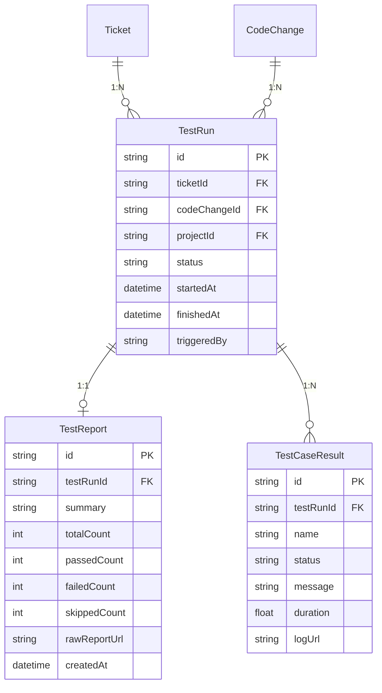
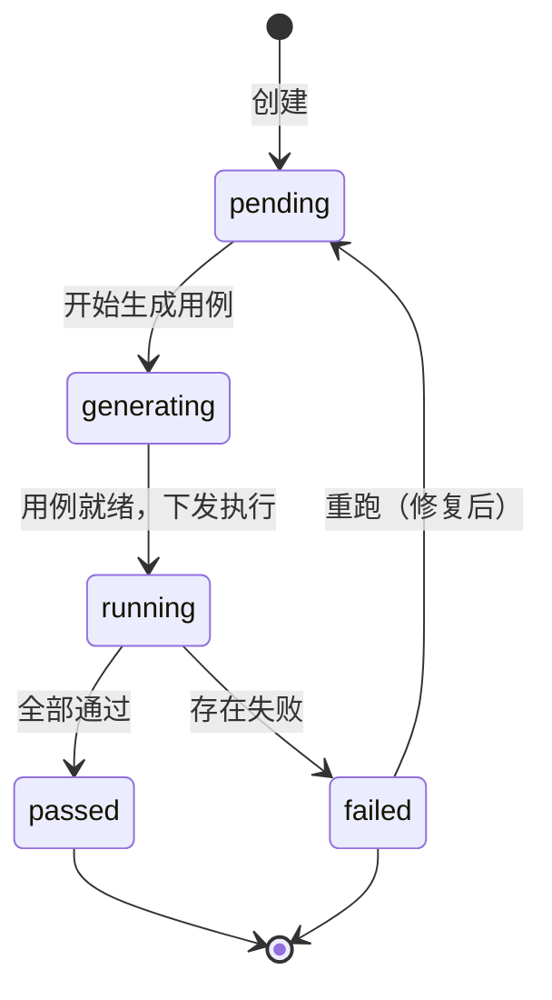

# M9 - 测试用例生成与执行 · 详细设计

本文档对 **M9 测试用例生成与执行** 模块进行详细设计，包括业务边界、数据模型、接口定义、状态与流程、权限规则及与上下游的集成方式。依据 [产品设计文档-运维Agent生产系统.md](产品设计文档-运维Agent生产系统.md)、[模块设计文档-运维Agent生产系统.md](模块设计文档-运维Agent生产系统.md)、[产品架构文档-运维Agent生产系统.md](产品架构文档-运维Agent生产系统.md)。

---

## 1. 模块概述

### 1.1 职责边界

- **测试用例生成**：根据工单类型、方案/设计（FixPlan/DesignDoc）与代码变更（CodeChange），由 Agent/LLM 生成结构化用例描述或与项目技术栈一致的测试脚本（如 pytest、Jest）。
- **测试执行**：在隔离环境（Docker 或 CI Runner）中执行测试，采集统一格式报告（如 JUnit XML），保证可复现与隔离。
- **报告解析与存储**：将原始报告解析为统一结构（总数/通过/失败、用例列表、日志链接），摘要存库；原始报告文件存对象存储。
- **重跑与流转**：测试失败时支持重新修复后再次触发执行；测试通过后可进入发布/反馈环节，可选将测试报告提交 M7 二次 Review。

### 1.2 不归属 M9 的内容

- **代码生成与 Linter**（归属 M8）；M9 仅在 Lint 通过后由工作流触发。
- **人工 Review**（归属 M7）；M9 产出报告后可被 M7 展示与二次 Review。
- **项目与 Agent 配置**（归属 M1）；M9 仅消费项目与执行环境配置。
- **发布/部署**（可选模块）；M9 测试通过后由工作流或人工决定是否进入发布。

---

## 2. 数据模型

### 2.1 ER 关系概览

### 2.2 实体定义

#### 2.2.1 TestRun（测试执行）

| 字段 | 类型 | 必填 | 说明 |
|------|------|------|------|
| id | string | 是 | 主键，如 UUID 或雪花 ID |
| ticketId | string | 是 | 关联工单 |
| codeChangeId | string | 是 | 关联代码变更（M8 产出） |
| projectId | string | 是 | 项目 ID，用于隔离与配置 |
| status | string | 是 | 状态：pending / generating / running / passed / failed |
| startedAt | datetime | 否 | 开始执行时间 |
| finishedAt | datetime | 否 | 结束时间 |
| triggeredBy | string | 否 | 触发方式：workflow / manual / retry |
| createdAt | datetime | 是 | 创建时间 |
| updatedAt | datetime | 是 | 更新时间 |

**约束**：同一 (ticketId, codeChangeId) 可有多条 TestRun（支持重跑）；按 id 或 (ticketId, 时间倒序) 查询最新一次执行。

#### 2.2.2 TestReport（测试报告）

| 字段 | 类型 | 必填 | 说明 |
|------|------|------|------|
| id | string | 是 | 主键 |
| testRunId | string | 是 | 关联 TestRun，一对一 |
| summary | string | 否 | 文字摘要（如「全部通过」「2 个失败」） |
| totalCount | int | 是 | 用例总数 |
| passedCount | int | 是 | 通过数 |
| failedCount | int | 是 | 失败数 |
| skippedCount | int | 否 | 跳过数，默认 0 |
| rawReportUrl | string | 否 | 原始报告文件在对象存储的 URL |
| createdAt | datetime | 是 | 创建时间 |

**约束**：每个 TestRun 至多一条 TestReport；执行完成（passed/failed）后写入。

#### 2.2.3 TestCaseResult（用例结果）

| 字段 | 类型 | 必填 | 说明 |
|------|------|------|------|
| id | string | 是 | 主键 |
| testRunId | string | 是 | 关联 TestRun |
| name | string | 是 | 用例名称或标识 |
| status | string | 是 | passed / failed / skipped |
| message | string | 否 | 失败时的错误信息或堆栈摘要 |
| duration | float | 否 | 执行耗时（秒） |
| logUrl | string | 否 | 单用例日志链接（可选） |

**约束**：用于列表展示与失败定位；可从 JUnit/报告解析写入。

#### 2.2.4 TestCaseSpec（用例规格，生成阶段）

生成阶段产出，可落库或仅作执行输入：

| 字段 | 类型 | 说明 |
|------|------|------|
| name | string | 用例名称 |
| description | string | 用例描述 |
| scriptPath | string | 脚本路径或标识（如 pytest 用例 id） |
| type | string | unit / integration / e2e（可选） |

---

## 3. 接口设计

### 3.1 测试执行（TestRun）

| 方法 | 路径 | 说明 | 权限 |
|------|------|------|------|
| GET | /api/projects/:projectId/tickets/:ticketId/test-runs | 工单下测试执行列表（按时间倒序） | 项目成员 |
| GET | /api/projects/:projectId/test-runs/:testRunId | 单次执行详情（含状态、时间） | 项目成员 |
| POST | /api/projects/:projectId/tickets/:ticketId/test-runs | 触发一次测试执行（工作流或人工重跑） | 项目成员（reviewer/admin 或工作流） |

**请求/响应示例（触发执行）**：

- 请求：`POST /api/projects/:projectId/tickets/:ticketId/test-runs`  
  Body: `{ "codeChangeId": "xxx", "triggeredBy": "manual" }`
- 响应：`201` Body: `{ "id": "...", "ticketId": "...", "status": "pending", ... }`

### 3.2 测试报告（TestReport）

| 方法 | 路径 | 说明 | 权限 |
|------|------|------|------|
| GET | /api/projects/:projectId/test-runs/:testRunId/report | 获取测试报告摘要与用例结果列表 | 项目成员 |

**响应示例**：

- `200` Body: `{ "testRunId": "...", "summary": "通过 8，失败 2", "totalCount": 10, "passedCount": 8, "failedCount": 2, "rawReportUrl": "https://...", "cases": [ { "name": "...", "status": "failed", "message": "..." }, ... ] }`

### 3.3 测试用例生成（内部或可选开放）

| 方法 | 路径/用途 | 说明 |
|------|------------|------|
| 内部 | GenerateTestCases(ticketId, codeChangeId) | 由工作流或 RunTests 前调用，生成用例规格或脚本；结果可写回 TestRun 或仅作执行输入 |

若对工作台开放「仅生成不执行」：

| 方法 | 路径 | 说明 | 权限 |
|------|------|------|------|
| POST | /api/projects/:projectId/tickets/:ticketId/generate-tests | 仅生成用例（预览），不执行 | 项目成员 |

### 3.4 与工作流集成

- 工作流在「Lint 通过」节点调用 **RunTests**（或等价 API），传入 projectId、ticketId、codeChangeId；M9 创建 TestRun（status=pending），异步执行，完成后更新 status 与 TestReport。
- 工作流可轮询或订阅 TestRun 状态；当 status=passed 或 failed 时进入下一节点（发布可选或失败回退）。

---

## 4. 状态与流程

### 4.1 测试执行状态

- **pending**：已创建，排队等待生成与执行。
- **generating**：Agent/服务正在根据方案与代码变更生成测试用例。
- **running**：用例已在 Runner 中执行中。
- **passed**：全部通过，可进入发布或反馈。
- **failed**：存在失败用例，可查看报告后修复并重跑。

### 4.2 端到端流程

1. 工作流在「Lint 通过」后调用 M9 执行测试（或用户从工单/报告页点击「执行测试」）。
2. M9 根据 ticketId、codeChangeId 拉取方案与变更信息，调用 **GenerateTestCases** 生成用例（脚本或描述）。
3. 将用例下发至 Docker/CI Runner，执行测试，采集 JUnit XML 或统一格式输出。
4. 解析报告，写入 TestReport、TestCaseResult；原始报告上传对象存储，rawReportUrl 落库。
5. 更新 TestRun.status 为 passed 或 failed；工作流根据状态推进或回退；用户可在工作台查看报告与重跑。

### 4.3 失败与重跑

- 测试失败后，开发/Agent 修复代码，经 M8 再次 Lint 通过后，可由工作流自动或用户手动再次触发 **RunTests**（新 CodeChange 或同一 CodeChange 重跑），生成新的 TestRun。
- 列表展示同一工单下多次 TestRun，便于对比与追溯。

---

## 5. 业务规则

- **触发条件**：仅当该工单存在已通过 Lint 的 CodeChange 时允许触发测试；工作流触发时一般使用当前已通过的 codeChangeId。
- **隔离与配置**：执行环境（Docker 镜像、Runner 池、测试框架）按 projectId 从 M1 或独立配置表读取，与现有 CI 一致。
- **报告格式**：优先解析 JUnit XML；其他格式可适配解析器，输出统一结构（total/passed/failed、cases[]）。
- **权限**：仅项目成员可查看测试列表与报告；触发执行可由 reviewer/admin 或工作流调用。
- **存储**：TestRun、TestReport、TestCaseResult 存 PostgreSQL；原始报告存对象存储，链接存 DB。

---

## 6. 与上下游集成

- **M8**：依赖 M8 的 CodeChange 与 Lint 通过状态；测试基于通过 Lint 的代码变更执行。
- **M1**：依赖项目与执行环境配置（测试框架、Runner 等）；权限校验依赖 M1 项目成员。
- **M7**：测试报告可被 M7 汇总展示（待审项类型可为 testReport）；可选「测试报告二次 Review」。
- **工作流**：由工作流在 Lint 通过后触发 M9；M9 执行完成后回调或更新状态，工作流根据 passed/failed 推进或回退。
- **对象存储**：原始报告文件上传至对象存储，按 projectId/ticketId/testRunId 组织路径。

---

## 7. 页面与功能映射

| 功能 | 页面/入口 | 说明 |
|------|-----------|------|
| 测试执行列表 | 工单详情内「测试」Tab 或独立「测试执行」列表 | 按工单或项目筛选，展示 TestRun 列表（状态、时间、通过率） |
| 触发执行/重跑 | 列表或工单详情「执行测试」「重跑」按钮 | 调用触发接口，创建 TestRun，跳转详情或刷新列表 |
| 测试报告详情 | 测试执行详情页 | 单次 TestRun 的摘要、用例列表（通过/失败/跳过）、失败信息、原始报告下载链接 |

以上页面需遵循 [页面原型风格规范.md](页面原型风格规范.md)，具体原型见 [M9-页面原型说明.md](M9-页面原型说明.md)。
