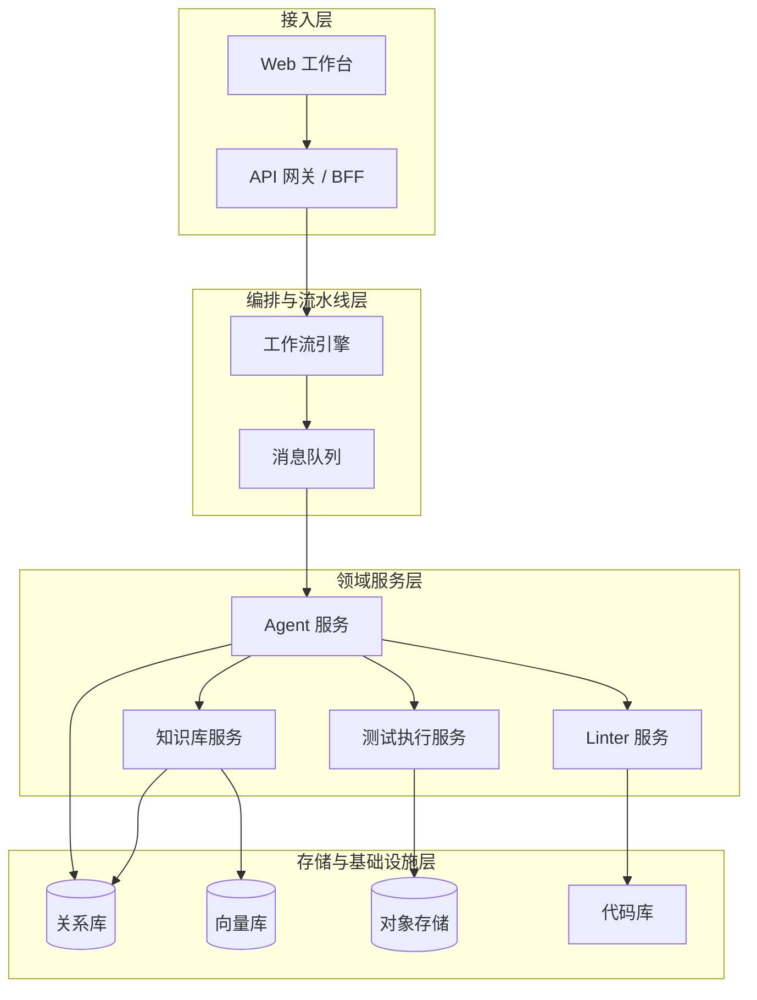
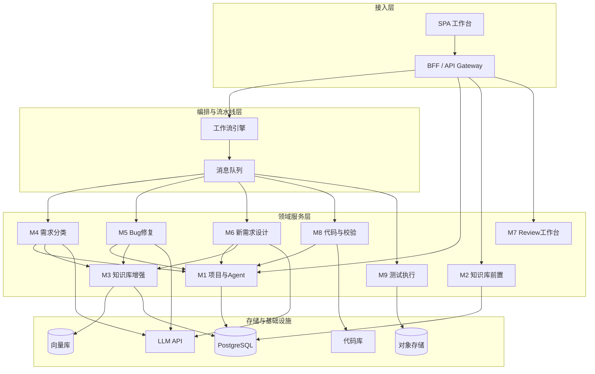
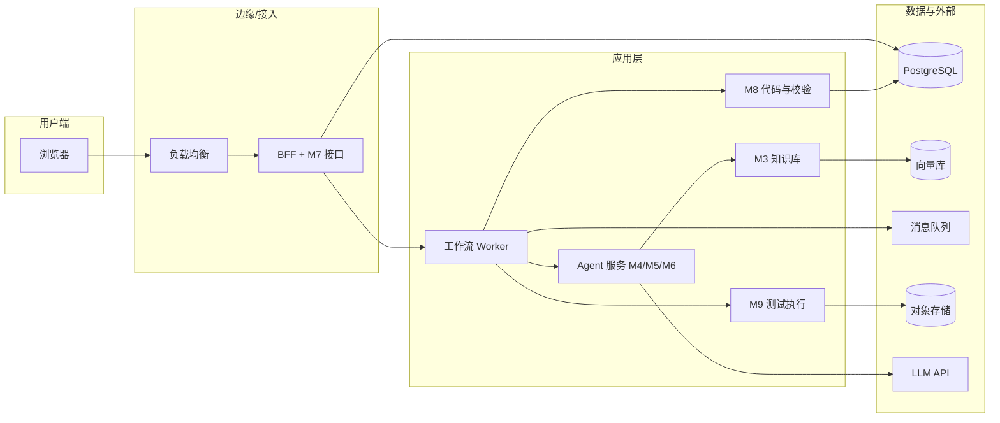

# 运维 Agent 生产系统 - 产品架构文档

本文档基于 [产品设计文档-运维Agent生产系统.md](产品设计文档-运维Agent生产系统.md) 与 [模块设计文档-运维Agent生产系统.md](模块设计文档-运维Agent生产系统.md)，从架构视角描述系统分层、模块划分、各模块架构选型及跨模块技术决策，供技术选型与实现参考。

---

## 1. 文档说明与引用

| 文档 | 用途 |
|------|------|
| 产品设计文档 | 业务闭环、功能模块、角色、非功能约束 |
| 模块设计文档 | 模块职责、核心实体、对外接口、依赖关系 |
| **产品架构文档（本文）** | 系统分层、部署形态、各模块架构选型、技术栈与集成方式 |

---

## 2. 产品架构总览

### 2.1 分层架构

系统采用分层架构，自上而下分为：接入层、编排与流水线层、领域服务层（含 Agent/知识库/质量保障）、存储与基础设施层。

### 2.2 模块与分层映射

| 分层 | 对应模块 | 说明 |
|------|----------|------|
| 接入层 | 前端 + 网关 | 工作台、API 网关/BFF，承接 M1～M9 的读写与工作流触发 |
| 编排与流水线层 | 工作流 + 消息 | 串联 M4→M5/M6→M7→M8→M9，人工卡点与异步任务 |
| 领域服务层 | M1～M9 业务模块 | 项目与 Agent(M1)、知识库前置(M2)、知识库增强(M3)、需求分类(M4)、Bug/设计(M5/M6)、Review(M7)、代码与校验(M8)、测试(M9) |
| 存储与基础设施层 | 关系库、向量库、对象存储、代码库 | 多租户按 projectId 隔离 |

### 2.3 整体架构图（含模块与选型）

---

## 3. 各模块架构选型

### 3.1 M1 - 多项目与 Agent 实例管理

| 维度 | 选型建议 | 说明 |
|------|----------|------|
| **部署形态** | 与 BFF/网关同进程或独立微服务 | 读多写少，可先与 BFF 合并，项目与权限规模大时拆成独立服务 |
| **存储** | PostgreSQL | 项目、Agent 配置、成员关系存关系库；配置可做版本或快照表 |
| **配置存储** | 关系库 + 可选配置中心 | Agent 的 Prompt 模板、工具链 JSON 存 DB；若需动态热更可接 Apollo/Nacos |
| **权限模型** | RBAC 按项目 | 角色：demander / reviewer / admin；校验接口供 BFF 与工作流调用 |
| **代码库与密钥** | 密钥管理服务 + 仓库只读凭证 | 不落盘敏感信息；克隆/拉取代码通过 Agent 或 M8 使用临时凭证 |
| **接口风格** | REST / 内部 gRPC | 对外 REST；内部若多语言可 gRPC |

**关键依赖**：关系库、可选配置中心、密钥管理服务。

---

### 3.2 M2 - 项目信息与知识库前置维护

| 维度 | 选型建议 | 说明 |
|------|----------|------|
| **部署形态** | 与 BFF 同体或独立服务 | 强依赖 M1、M3；可先作为 BFF 内领域逻辑，体量大时拆出 |
| **存储** | PostgreSQL | ProjectProfile、KnowledgeReadiness 及就绪规则配置 |
| **就绪规则** | 配置驱动 | 必填字段/最小文档集配置在 DB 或配置中心，校验逻辑可配置化 |
| **与 M3 协同** | 写 M3 索引 + 轮询/回调就绪 | 录入或更新项目信息后调用 M3 写入索引；M3 索引完成后回调或 M2 轮询 M3 状态以更新 isReady |
| **接口风格** | REST | 供工作台与需求提交入口调用 |

**关键依赖**：M1、M3、PostgreSQL。

---

### 3.3 M3 - 知识库与系统理解增强

| 维度 | 选型建议 | 说明 |
|------|----------|------|
| **向量库** | Qdrant / Milvus / pgvector 选一 | 按 projectId 建 collection/namespace；pgvector 与主库同库，运维简单；Qdrant/Milvus 适合大规模向量 |
| **Embedding** | 统一 Embedding 服务 | 文本与代码片段用同一或分模型；OpenAI Embedding / 国产或自建模型，按项目可配置 |
| **文档索引流水线** | 异步任务 + 队列 | 大文档分块、embedding、写入向量库通过任务队列执行，避免阻塞 API |
| **代码索引** | 按语言/目录 Chunk + Embedding 或 CodeBERT 类检索 | 关键目录可配置；增量依赖 Git 事件或定时扫描 |
| **更新触发** | Webhook + 定时 + 手动 | MR 合并触发增量；定时全量/增量兜底；管理端支持手动触发 |
| **检索接口** | 统一 Search(projectId, query, topK) | 仅查当前项目；可加过滤（文档类型、时间范围） |
| **部署形态** | 独立服务 | 依赖向量库与 Embedding 服务，建议独立部署便于扩缩容 |

**关键依赖**：向量库、Embedding 服务、PostgreSQL（元数据）、代码库只读。

---

### 3.4 M4 - 需求理解与分类

| 维度 | 选型建议 | 说明 |
|------|----------|------|
| **Agent 框架** | LangChain / LlamaIndex / 自研 选一 | 编排 LLM 调用与工具（检索、读配置）；按项目加载 Prompt 与工具链 |
| **LLM** | 统一 LLM API 网关 | OpenAI 兼容接口或国产/私有化模型；按项目配置 model、temperature 等 |
| **上下文来源** | M3.Search + 工单内容 | 先查知识库再拼 Prompt；可选带代码索引检索结果 |
| **执行方式** | 工作流内异步 Task | 由工作流引擎调起，结果写工单并驱动 M5/M6 分支 |
| **存储** | PostgreSQL | Ticket、AnalysisResult 与 M4 产出均落库 |
| **部署形态** | 与 Agent 运行时同体或独立 | 可与 M5/M6 共用 Agent 服务，通过不同 Workflow 节点区分 |

**关键依赖**：M1、M2（前置校验）、M3、LLM API、工作流引擎、PostgreSQL。

---

### 3.5 M5 - Bug 修复流程 / M6 - 新需求设计流程

| 维度 | 选型建议 | 说明 |
|------|----------|------|
| **Agent 框架** | 与 M4 一致 | 同一套 LangChain/LlamaIndex，不同 Prompt 与工具组合；M5 侧重根因与修复方案，M6 侧重设计与模块划分 |
| **输入** | 工单 + M3 检索 + 代码库只读 | 方案/设计仅输出结构化文档与建议文件列表，不直接写代码 |
| **输出** | FixPlan / DesignDoc 结构化数据 | 存 PostgreSQL，供 M7 展示与 M8 消费 |
| **执行方式** | 工作流节点异步调用 | 由工作流在「分析完成」后按 type 触发 M5 或 M6 |
| **部署形态** | 与 M4 同 Agent 服务 | 共享模型与知识库访问，仅逻辑与 Prompt 分离 |

**关键依赖**：M1、M3、M4（工单）、LLM API、工作流、PostgreSQL。

---

### 3.6 M7 - 人工 Review 工作台

| 维度 | 选型建议 | 说明 |
|------|----------|------|
| **前后端** | 工作台为 SPA，接口由 BFF 聚合 | 待审列表、方案/代码/报告内容由 BFF 从各模块或统一工单服务拉取 |
| **状态与工作流** | 工作流「用户任务」或「信号」 | 待审项对应工作流中的 Human Task；通过/驳回即完成 Task 并传参，驱动下一节点或回退 |
| **审计日志** | 写 PostgreSQL | ReviewRecord 含 operatorId、action、comment、timestamp；不可篡改，可只追加 |
| **权限** | 依赖 M1 的 reviewer 角色 | 仅 reviewer/admin 可提交通过/驳回；列表可按项目与权限过滤 |
| **部署形态** | 无状态，与 BFF 一体 | 纯 API + 前端，无独立进程 |

**关键依赖**：M1、M5/M6（方案）、M8（代码与 Lint 结果）、M9（测试报告）、工作流引擎、PostgreSQL。

---

### 3.7 M8 - 代码生成与语法校验

| 维度 | 选型建议 | 说明 |
|------|----------|------|
| **代码生成** | Agent 调用 LLM + 方案/设计上下文 | 输入 FixPlan/DesignDoc 与必要代码片段，输出 patch 或新文件；可接 Cursor/IDE 风格 API 或自研 |
| **执行环境** | 隔离沙箱或临时目录 | 生成结果先落临时目录或内存，经 Linter 后再决定是否落库/推送 |
| **Linter** | 按项目配置调用现有工具 | ESLint / Pylint / go vet 等通过 CLI 或容器内执行；结果解析为标准结构（行号、消息、严重级别） |
| **结果存储** | PostgreSQL + 可选对象存储 | CodeChange、LinterResult 存 DB；大 patch 可存对象存储，DB 存引用 |
| **触发方式** | 工作流在「Review 通过」后触发 | 仅方案/代码 Review 通过后执行；失败可重试或回退到 M5/M6 |
| **部署形态** | 独立服务或与 Agent 同体 | 若 Linter 需容器/多语言环境，建议独立 Runner 池；否则可与 Agent 同进程 |

**关键依赖**：M1、M5/M6、M7、LLM API、代码库、Linter CLI/容器、PostgreSQL。

---

### 3.8 M9 - 测试用例生成与执行

| 维度 | 选型建议 | 说明 |
|------|----------|------|
| **用例生成** | Agent/LLM 根据方案与代码变更生成用例描述或脚本 | 输出为结构化用例或 pytest/Jest 等脚本，与项目技术栈一致 |
| **执行环境** | Docker 或 CI Runner | 与现有 CI 一致：在容器或专用 Runner 中执行，保证隔离与可复现 |
| **报告格式** | JUnit XML / 统一 Schema | 解析为统一结构：total/passed/failed、用例列表、日志链接；原始报告存对象存储 |
| **存储** | PostgreSQL + 对象存储 | TestRun、TestReport 摘要存 DB；rawReportUrl 指向对象存储 |
| **触发方式** | 工作流在「Lint 通过」后触发 | 可配置为必跑或按标签跑；失败可重新触发或回退到 M8 |
| **部署形态** | 独立测试执行服务 + Runner 池 | 与 CI 共用 Runner 或独立池；执行服务负责排队、下发、收集结果 |

**关键依赖**：M1、M8、对象存储、Docker/CI Runner、PostgreSQL。

---

## 4. 跨模块架构决策

### 4.1 工作流引擎选型

| 选项 | 适用场景 | 说明 |
|------|----------|------|
| **Temporal** | 需要强一致、可重试、可观测的长流程 | 支持人工任务、信号、定时器；多语言 SDK；适合生产级流水线 |
| **Prefect** | Python 技术栈、偏数据/脚本流水线 | 与 Python Agent 集成简单；人工节点需自建或通过 Webhook |
| **状态机 + 任务队列** | 轻量、快速落地 | 工单状态机在 DB，节点对应队列消费；人工节点通过「待办表 + 回调」实现 |

**建议**：中长期选 Temporal 或 Prefect 之一，保证人工卡点与回退清晰；MVP 可用「状态机 + Redis/RabbitMQ」。

### 4.2 消息队列选型

| 选项 | 适用场景 |
|------|----------|
| **Redis Streams / List** | 轻量、已有 Redis，任务量不大 |
| **RabbitMQ** | 需要可靠投递、多消费者、死信与重试 |
| **Kafka** | 高吞吐、事件溯源、多下游消费 |

**建议**：与工作流引擎配套；Temporal 可不用额外 MQ（由 Temporal 调度）；自建状态机时用 RabbitMQ 或 Redis。

### 4.3 存储选型汇总

| 用途 | 选型 | 说明 |
|------|------|------|
| 关系数据 | PostgreSQL | 项目、工单、Review、配置、审计等；按 projectId 分区或索引 |
| 向量检索 | Qdrant / Milvus / pgvector | 知识库与代码索引；按 projectId 隔离 |
| 对象存储 | S3 / OSS / MinIO | 测试报告、构建产物、知识库原始文件 |
| 代码库 | Git（只读克隆） | 由 M8/M3 使用；不落盘敏感凭证 |

### 4.4 安全与多租户

- **认证**：统一 SSO 或 IdP；BFF 校验 Token，将 userId 注入下游。
- **授权**：按 M1 项目成员与角色做接口级校验；工作流仅操作已授权项目。
- **多租户**：所有存储按 projectId 隔离；向量库用 namespace/collection；日志与审计带 projectId。
- **敏感数据**：代码与密钥经密钥管理服务或短期凭证访问；不写日志、不落盘。

### 4.5 可观测性

- **日志**：结构化日志，带 projectId、ticketId、traceId；集中采集（如 ELK/Loki）。
- **指标**：各阶段耗时、成功率、队列积压；工单状态分布；Linter/测试通过率。
- **链路**：分布式 Trace（如 OpenTelemetry），从 BFF 到工作流、Agent、M3、M8、M9 全链路。
- **告警**：关键失败（如 Linter/测试大面积失败、队列堆积）与人工任务超时。

---

## 5. 部署与运行视图

### 5.1 建议部署拓扑（逻辑）

### 5.2 模块与进程/容器对应（建议）

| 进程/容器 | 包含模块/组件 |
|-----------|----------------|
| BFF / API 网关 | 接入层、M1 查询与写、M2、M7 接口 |
| 工作流 Worker | 工作流引擎、任务消费、调用 M4/M5/M6/M8/M9 |
| Agent 服务 | M4、M5、M6（需求分类、Bug 方案、新需求设计） |
| 知识库服务 | M3（索引、检索、反馈写入） |
| 代码与校验服务 | M8（生成、Linter 调用） |
| 测试执行服务 | M9（用例生成、执行、报告解析） |
| 共享基础设施 | PostgreSQL、向量库、MQ、对象存储、LLM 网关 |

---

## 6. 小结

- **产品架构**：分层清晰，接入 → 编排 → 领域服务 → 存储；模块 M1～M9 与层次对应明确。
- **各模块架构选型**：已在第 3 节按模块给出部署形态、存储、接口风格、关键依赖与推荐技术栈。
- **跨模块决策**：工作流（Temporal/Prefect/状态机+队列）、消息、存储、安全与可观测性统一约定，便于实现与运维一致。

本文档与产品设计文档、模块设计文档一起，构成「产品 → 模块 → 架构」的完整设计链，可直接用于技术评审与开发落地。
