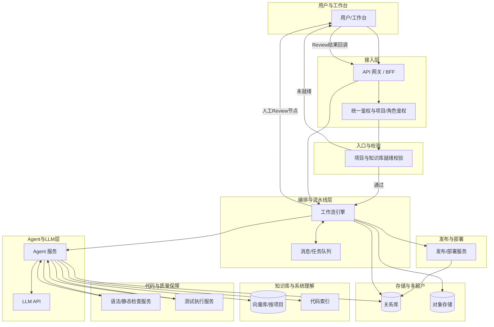

# 运维 Agent 生产系统 - 产品架构文档

## 一、文档目的与范围

本文档描述运维 Agent 生产系统的**技术架构**，与《产品设计文档-运维Agent生产系统》中的业务闭环、功能模块、角色权限相配套，便于开发选型与落地实现。范围包括：系统分层、组件职责、技术选型、架构图、以及安全、可观测性、发布回滚等非功能设计。

---

## 二、架构原则

| 原则 | 说明 |
|------|------|
| **多项目隔离、Agent 可配置** | 按项目维度隔离配置、知识库、流水线，每个项目对应一个可配置的 Agent 实例（含模型、Prompt、工具链）。 |
| **复用现有工具链** | 语法检查、测试、构建尽量复用现有 CI/Linter/测试框架，避免重复造轮子，与现有发布流程一致。 |
| **异步流水线 + 人工卡点** | 需求分析、代码生成、测试等可异步执行；Review 为同步人工卡点，通过后再触发下游，便于审计与回滚。 |
| **知识集中、按项目检索** | 每项目独立知识库 + 代码索引，RAG 检索仅限当前项目，减少噪音、提高命中率与响应速度。 |
| **知识库前置** | 新项目接入后须先完成项目信息入知识库；需求/Bug 提交时由**入口服务**校验知识库就绪状态，未就绪则拒绝进入分析流程。 |

---

## 三、工作流引擎与 Agent 的边界

- **工作流引擎**负责：阶段编排、超时与重试、人工卡点（如「待 Review」节点）、状态持久化、与消息队列的衔接。不负责具体「理解需求」「生成方案」「生成代码」等智能逻辑。
- **Agent 服务**负责：在单个步骤内完成「需求理解与分类」「方案/修复设计」「代码生成」等，可调用 LLM、知识库检索、代码库只读、Linter、测试等；每个步骤的输入/输出由工作流定义并传递。
- **集成方式**：工作流中每个「分析」「设计」「生成代码」等节点，通过任务类型 + 输入/输出契约调用 Agent 服务；人工 Review 节点由工作流挂起，待用户在工作台操作后通过 API 回调恢复工作流并传入通过/驳回结果。

---

## 四、系统架构图

**说明**：

- **项目与知识库就绪校验**：位于接入层之后、工作流之前；需求/工单提交 API 在创建工单或启动工作流前调用该校验，未通过则直接返回错误并引导先完成知识库维护。
- **人工 Review**：作为工作流中的「待办节点」，由工作台展示待 Review 项，用户操作后经 API 回调将结果写回工作流并驱动后续节点（代码生成或回流）。
- **发布/部署服务**：工作流在测试通过后可选调用发布服务（或对接现有 CI/CD），发布结果与回滚信息回写 DB。

---

## 五、分层与组件说明

### 5.1 接入层

- **Web 前端**：React/Vue + 工作台（需求提交、任务列表、Review 界面、测试报告、发布确认）。
- **API**：REST 或 BFF，统一鉴权、按项目/角色鉴权；所有涉及「创建需求/工单」或「启动流水线」的接口，必须先经**项目与知识库就绪校验**。

### 5.2 项目与知识库就绪校验（入口组件）

- **职责**：在需求/Bug 提交或工作流启动前，校验当前项目是否已完成最小必要的知识库维护（如项目概述、架构/目录、关键配置等）。
- **归属**：作为 API 层或 BFF 的**统一校验逻辑**，可由独立服务或网关内嵌实现；未通过时返回明确错误码与提示，不创建工单、不启动工作流。
- **判定标准**：由产品设计文档约定（如必填字段、最小文档集、索引是否已构建），此处仅约定「校验发生时机」与「失败时拒绝进入分析/修复流程」。

### 5.3 编排与流水线层

- **工作流引擎**：推荐 **Temporal** 或 **Prefect**（需长时间等待、人工任务、重试与超时时优先）；若团队更倾向轻量，可采用「状态机 + 任务队列」实现简化版 DAG。将「需求分析 → 方案/修复 → Review 等待 → 代码生成 → 语法检查 → 测试 → 报告 → 发布」串成可重试、可观测的流水线；人工 Review 对应「用户任务」或「等待外部事件」节点。
- **消息/队列**：Redis/RabbitMQ/Kafka 任选一，用于异步任务下发与事件驱动（如 Review 通过后触发代码生成）。

### 5.4 Agent 与 LLM 层

- **Agent 框架**：LangChain / LlamaIndex / 自研 Agent SDK 选一，实现「需求理解 → 分类(Bug/新需求) → 方案生成 → 代码生成」；每个项目绑定一套 Prompt + 工具（调用代码库、知识库、Linter、测试）。与工作流通过「任务类型 + 输入/输出契约」集成。
- **大模型**：通过统一 API（OpenAI/国产大模型/私有化）按项目可配置模型与参数。

### 5.5 代码与质量保障层

- **语法/静态检查**：直接调用项目现有 ESLint/Pylint/go vet 等，或统一封装成「执行脚本 → 解析结果」服务。
- **测试**：按项目类型调用 pytest/Jest/go test 等，在隔离环境（Docker 或 CI Runner）中执行，产出统一格式测试报告（如 JUnit XML），由系统解析并展示。

### 5.6 知识库与系统理解

- **向量库**：Milvus / Qdrant / pgvector / 云厂商向量库，按项目建索引；文档与代码片段做 embedding。
- **知识来源**：项目文档、架构说明、历史 MR/Issue、Runbook 入库；代码索引对关键目录做 chunk + embedding 或专用检索模型。
- **更新策略**：MR 合并后 webhook 触发增量索引，或定时全量/增量；变更反馈（如本次修复摘要）可选回写知识库。

### 5.7 存储与多租户

- **关系库**：项目元数据、用户与权限、工单/需求/Review 记录、流水线状态（PostgreSQL/MySQL）。
- **对象存储**：测试报告、构建产物、知识库原始文件（S3/OSS/MinIO）。
- **多项目**：项目 ID 贯穿所有表与索引，Agent 实例配置、知识库 namespace 均按项目隔离。

---

## 六、发布与回滚

### 6.1 定位

- 发布/部署是业务闭环的一环，在「测试通过并生成报告」之后，可由人工确认或按策略自动执行。
- 架构上由**发布/部署服务**承接：可与现有 CI/CD（如 Jenkins、GitLab CI、GitHub Actions）对接，或提供独立发布接口（如发布到预发/生产、打 tag、生成发布单）。

### 6.2 发布策略（建议）

- **人工确认发布**：工作流在测试通过后进入「待发布」节点，用户在工作台确认后，由 API 触发发布服务执行发布。
- **自动发布到预发**（可选）：测试通过后自动发布到预发环境，生产发布仍保留人工确认。
- **触发方式**：工作流调用发布服务 API，传入项目 ID、工单 ID、代码版本（commit/tag）、目标环境等；发布结果（成功/失败、发布单 ID）回写 DB 并可选回写知识库。

### 6.3 回滚策略（建议）

- **回滚依据**：以发布时的 commit/tag 或发布单为基准，回滚时执行「回滚到上一可用版本」或「回滚到指定版本」。
- **执行方式**：由发布服务或现有 CI/CD 执行回滚脚本/流水线；回滚记录写 DB，与工单关联，便于审计与知识沉淀（如将「某次回滚原因」写入知识库）。

### 6.4 与工作流的衔接

- 工作流图中「发布/部署服务」在测试通过后由工作流调用；若发布失败，可配置重试或进入「待处理」由人工介入，再决定重试或回滚。

---

## 七、安全与合规

### 7.1 执行环境隔离

- 代码生成、Linter、测试等均在**受控环境**中执行（如专用容器、CI Runner、隔离沙箱），不将代码或敏感配置落盘到不可控环境。
- 对生产/预发等环境的访问通过发布服务与现有权限体系控制，不由 Agent 直接写生产。

### 7.2 密钥与配置

- 密钥、API Key、仓库凭证等通过统一密钥管理（如云厂商 Secret Manager、Vault）注入，不写入代码或配置文件；按项目/环境隔离访问权限。

### 7.3 审计与留痕

- 所有 Review 操作（通过/驳回/评论）落库并留痕；工单状态变更、发布/回滚操作记录到审计日志，支持按项目、按用户、按时间查询，满足合规与事后追溯。

---

## 八、可观测性

### 8.1 需求处理各阶段

- **状态与耗时**：工作流引擎记录各节点开始/结束时间及状态（成功/失败/超时）；在工单详情与运营看板中展示阶段耗时、失败原因。
- **失败原因**：语法检查失败、测试失败、发布失败等，解析工具输出并写入工单或日志，便于排查与改进。

### 8.2 测试与质量

- **测试通过率、回归情况**：由测试报告解析得到，写入 DB；支持按项目、按时间聚合，用于质量看板与报表。

### 8.3 日志、指标与追踪

- **日志**：接入层、工作流、Agent、Linter、测试、发布服务等统一输出结构化日志（如 JSON），并汇聚到统一日志后端（如 ELK、Loki、云日志）。
- **指标**：关键操作 QPS、各阶段耗时分布、失败率、Review 平均耗时等，通过指标系统（如 Prometheus + Grafana）暴露与告警。
- **链路追踪**：请求 ID 或 Trace ID 从网关贯穿到工作流与 Agent，便于跨服务排查；可选与 OpenTelemetry 等标准集成。

上述数据由「工作流引擎 + 各服务」在运行过程中上报，架构上不新增独立组件，但需在部署与开发规范中约定日志格式、指标名称与追踪传递方式。

---

## 九、推荐技术栈汇总

| 层次 | 组件 | 推荐选项 |
|------|------|----------|
| 接入层 | 前端 | React / Vue |
| 接入层 | API | REST 或 BFF，统一鉴权 |
| 编排层 | 工作流引擎 | Temporal / Prefect / 状态机 + 任务队列 |
| 编排层 | 消息队列 | Redis / RabbitMQ / Kafka |
| Agent 层 | 框架 | LangChain / LlamaIndex / 自研 Agent SDK |
| Agent 层 | 大模型 | 统一 API（OpenAI/国产/私有化） |
| 质量保障 | 语法检查 | 复用项目 ESLint / Pylint / go vet |
| 质量保障 | 测试 | 复用 pytest / Jest / go test，JUnit 等报告 |
| 知识库 | 向量库 | Milvus / Qdrant / pgvector / 云向量库 |
| 存储 | 关系库 | PostgreSQL / MySQL |
| 存储 | 对象存储 | S3 / OSS / MinIO |
| 发布 | 发布/回滚 | 对接现有 CI/CD 或独立发布服务 |

---

## 十、为何该架构高效

- **少造轮子**：Linter、测试、构建直接复用现有工具，仅做封装与结果解析。
- **流水线清晰**：工作流引擎统一处理重试、超时、人工卡点，避免散落定时任务与回调地狱。
- **按项目隔离**：配置、知识库、Agent 均按项目切分，扩展新项目成本低，安全与数据隔离清晰。
- **知识可积累**：RAG + 代码索引 + 变更反馈写入，使 Agent 越用越懂当前项目，减少重复说明与错误。
- **入口可控**：知识库就绪校验在入口统一执行，保证进入分析/修复流程的项目均具备最小必要上下文。
- **发布与回滚可追溯**：发布/回滚与工单、版本、审计日志关联，形成完整闭环与合规基础。
