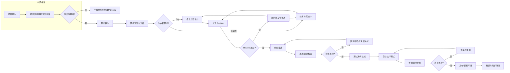
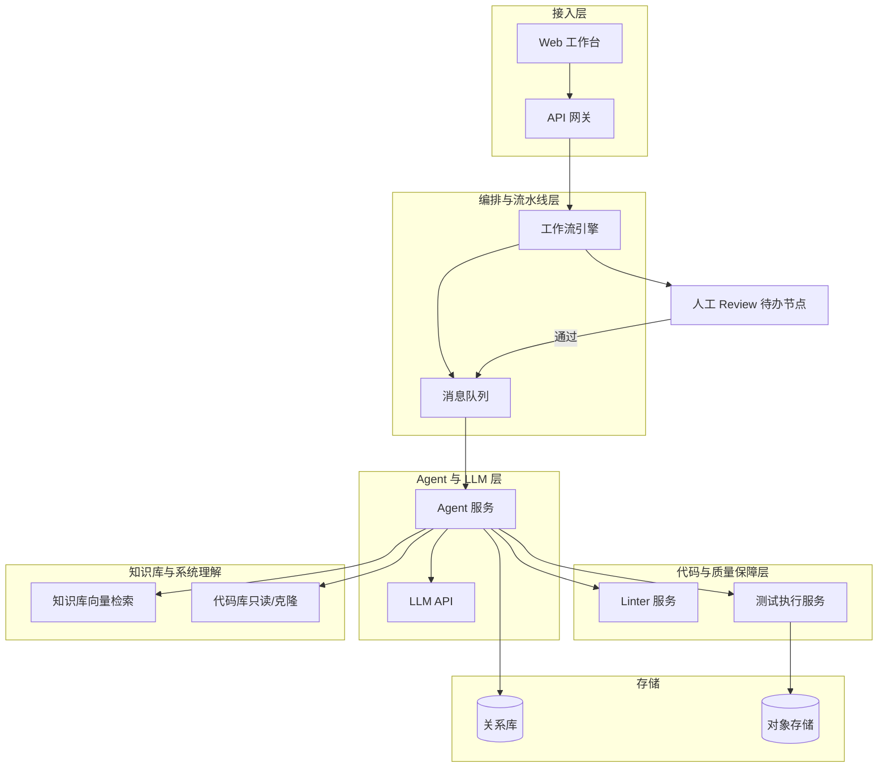
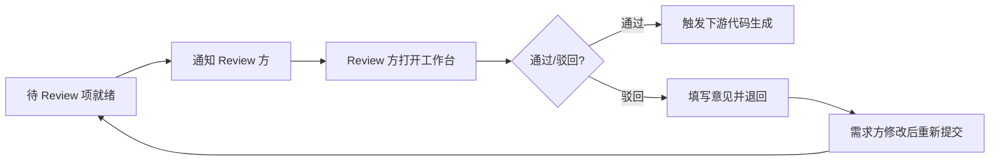
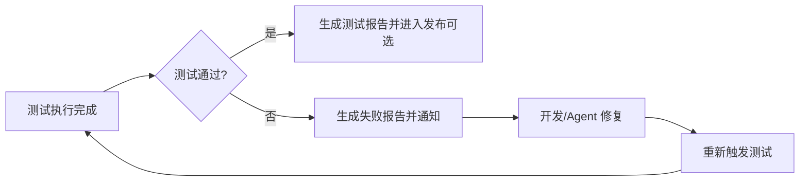
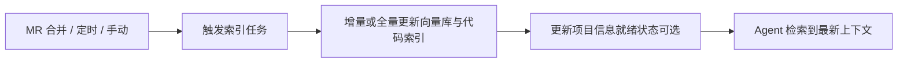

# 运维 Agent 生产系统 - 产品设计文档

## 1. 产品概述与目标

### 1.1 产品定位

为不同运维项目配置专属 Agent 实例的**生产级运维 Agent 生产系统**。每个运维项目可绑定独立 Agent，在统一平台上完成需求分析、方案设计、人工 Review、代码生成与校验、测试与报告等全流程。

### 1.2 核心价值

将日常运维需求（Bug 修复、新需求设计）经以下闭环处理，形成可追溯、可审计的交付链路：

- 需求输入与分类（Bug / 新需求）
- 方案或修复设计
- **人工 Review**（必须通过后才进入代码生成）
- 自动生成代码并做语法/静态检查
- 按需生成测试用例并自动执行，产出测试报告
- 可选发布/部署与反馈沉淀

### 1.3 前置条件

**在承接某项目的「新需求」或「Bug 修复」之前，必须先将该项目信息维护到对应的知识库中。** 未完成知识库维护的项目不可进入需求分析/修复流程，系统应对「知识库就绪」进行校验并拦截未就绪项目。

### 1.4 目标用户

- **需求方**：运维工程师、业务方，提交日常运维需求并查看进度与结果
- **Review 方**：开发/项目负责人，对方案与代码进行 Review，通过或驳回
- **项目管理员**：配置 Agent、知识库、发布策略与权限
- **系统管理员**：多项目、用户与权限、审计管理

---

## 2. 核心业务闭环

### 2.1 流程概览

从「项目与知识库就绪」到「上线/反馈」的完整闭环如下；流程图见 2.2 节。

1. **前置**：项目信息已维护至对应知识库（项目接入后必须先完成；未完成则不允许提交该项目的需求/Bug）
2. **需求输入** → **需求分类与分析**（Bug / 新需求）
3. **方案设计**：Bug 场景为修复方案，新需求场景为设计稿/技术方案
4. **人工 Review**：必须通过才进入代码生成
5. **代码生成** → **语法/静态检查**：不通过则回到修改或重新生成
6. **测试用例生成** → **自动执行测试** → **测试报告**
7. **发布/部署**（可选）：人工确认发布或自动发布到预发
8. **反馈与知识沉淀**：结果反馈、知识库更新，提升后续 Agent 对系统的理解

关键分支需体现：**Review 不通过**、**语法检查失败**、**测试失败**时的回流路径与提示。

### 2.2 主流程图（Mermaid）

---

## 3. 功能模块设计

| 模块 | 说明 | 与需求的对应 |
|------|------|--------------|
| 多项目与 Agent 实例管理 | 为每个运维项目创建/配置独立 Agent，关联代码库、环境、权限 | 为不同的运维项目配置对应的 Agent 实例 |
| 需求理解与分类 | 解析用户输入的运维需求，区分为 Bug / 新需求，并做意图与范围分析 | 输入日常运维需求，由运维机器人进行日常运维需求的分析 |
| Bug 修复流程 | 定位问题、生成修复方案与补丁，经 Review 后生成代码并校验、测试 | 如果是 Bug 可以进行修复 |
| 新需求设计流程 | 输出设计说明/技术方案，经 Review 后再进入实现（代码生成） | 如果是新需求，可以设计 |
| 人工 Review 工作台 | 统一展示待 Review 项（方案/代码/测试结果），通过/驳回/评论，审计日志 | 在执行代码生成之前，都要增加人工 Review 的过程 |
| 代码生成与语法校验 | Review 通过后触发生成；集成 linter/静态分析，保证语法无问题再进入测试 | Review 通过后，可自动生成代码，自动检查语法 |
| 测试用例生成与执行 | 按需求/变更自动生成测试用例，执行测试并生成测试报告 | 生成测试用例，并自动进行测试，生成测试报告 |
| 项目信息与知识库前置维护 | **前置必选**：新项目接入后，须先将项目信息（架构、目录结构、关键模块、配置说明、Runbook 等）维护至该项目的知识库；完成前不可处理该项目的需求/Bug | 需求优化：完成新需求或修改 Bug 之前需提前将项目信息维护到知识库 |
| 知识库与系统理解增强 | 每项目独立知识库（架构、变更历史、FAQ、Runbook）；代码索引、文档检索、变更反馈写入；作为需求/Bug 处理的前置条件与持续增强手段 | 支持知识库的维护，或更好方法，提高 Agent 对维护系统的理解 |

---

## 4. 知识库与「更好方法」的补充设计

### 4.1 前置约束

**在完成新需求或修改 Bug 之前，必须提前将项目信息维护到对应知识库。** 系统在接收某项目的需求/Bug 时，应校验该项目的知识库是否已就绪（如已录入项目概述、架构/目录、关键配置等最小必要信息）。未就绪则提示先完成知识库维护，**不允许进入**分析/设计/修复流程。

### 4.2 知识库维护

- 支持按项目维护：项目概述、架构图、目录结构、关键模块说明、配置说明、历史故障与解决方案、Runbook 等
- 支持版本与权限管理
- 明确「**项目信息就绪**」的判定标准：如必填字段、最小文档集合（如至少包含项目概述 + 架构/目录说明）

### 4.3 增强系统理解的其他手段

- **代码库索引**：基于代码的 embedding + 检索，便于 Agent 理解项目结构、关键模块、历史修改；可对关键目录做 chunk + embedding，或使用 CodeBERT 类模型做检索
- **变更历史与工单关联**：每次需求/修复与 commit、MR 关联，便于后续相似需求检索与复用
- **运行数据与监控摘要（可选）**：将告警、关键指标摘要纳入上下文，辅助根因与影响分析

### 4.4 更新策略

- 知识库与代码索引的更新时机：MR 合并后 webhook 触发增量索引、或定时全量/增量、或手动触发
- 形成「使用 → 反馈 → 知识沉淀」的闭环，使 Agent 越用越懂当前项目

---

## 5. 角色与权限

| 角色 | 职责 |
|------|------|
| 需求方 | 提交运维需求、查看本需求进度与结果 |
| Review 方 | 对方案/代码进行 Review，通过/驳回 |
| 项目管理员 | 配置 Agent、知识库、发布策略、项目内权限 |
| 系统管理员 | 多项目、用户与权限、审计 |

---

## 6. 非功能与约束

- **安全与合规**：代码与配置不落盘到不可控环境；Review 留痕；操作可审计
- **可观测性**：需求处理各阶段状态、耗时、失败原因；测试通过率、回归情况
- **闭环保证**：任一环节失败（Review 不通过、语法错误、测试失败）均有明确回流路径与通知，避免「断链」

---

## 7. 实现当前需求的最高效技术架构

### 7.1 架构原则

- **多项目隔离、Agent 可配置**：按项目维度隔离配置、知识库、流水线，每个项目对应一个可配置的 Agent 实例（含模型、Prompt、工具链）
- **复用现有工具链**：语法检查、测试、构建尽量复用现有 CI/Linter/测试框架，避免重复造轮子，与现有发布流程一致
- **异步流水线 + 人工卡点**：需求分析、代码生成、测试等可异步执行；Review 为同步人工卡点，通过后再触发下游，便于审计与回滚
- **知识集中、按项目检索**：每项目独立知识库 + 代码索引，RAG 检索只扫当前项目，减少噪音、提高命中率与响应速度
- **知识库前置**：新项目接入后须先完成项目信息入知识库；需求/Bug 提交时校验知识库就绪状态，未就绪则拒绝进入分析流程，保证 Agent 始终在具备项目上下文的前提下工作

### 7.2 推荐技术栈与分层

- **接入层**
  - Web 前端：React/Vue + 工作台（需求提交、任务列表、Review 界面、测试报告查看、知识库维护入口）
  - API：REST 或 BFF，统一鉴权、按项目/角色鉴权
- **编排与流水线层**
  - 工作流引擎：Temporal / Prefect / 或简单状态机 + 任务队列，将「需求分析 → 方案/修复 → Review 等待 → 代码生成 → 语法检查 → 测试 → 报告」串成可重试、可观测的 DAG；人工 Review 对应「用户任务」或「等待外部事件」节点
  - 消息/队列：Redis/RabbitMQ/Kafka 任选一，用于异步任务下发、事件驱动（如 Review 通过后触发代码生成）
- **Agent 与 LLM 层**
  - 统一 Agent 框架：LangChain / LlamaIndex / 自研 Agent SDK 选一，实现「需求理解 → 分类(Bug/新需求) → 方案生成」；每个项目绑定一套 Prompt + 工具（调用代码库、知识库、Linter、测试）
  - 大模型：通过统一 API（OpenAI/国产大模型/私有化）按项目可配置模型与参数
- **代码与质量保障层**
  - 语法/静态检查：直接调用项目现有 ESLint/Pylint/go vet 等，或统一封装成「执行脚本 → 解析结果」服务
  - 测试：根据项目类型调用 pytest/Jest/go test 等，在隔离环境（Docker 或 CI Runner）中执行，产出统一格式的测试报告（如 JUnit XML），再由系统解析并展示
- **知识库与系统理解**
  - 向量库：Milvus / Qdrant / pgvector / 云厂商向量库，按项目建索引；文档与代码片段做 embedding
  - 知识来源：项目文档、架构说明、历史 MR/Issue、Runbook 入库；代码索引对关键目录做 chunk + embedding 或 CodeBERT 类检索
  - 更新策略：MR 合并后 webhook 触发增量索引、或定时全量/增量，保证 Agent 检索到最新上下文
- **存储与多租户**
  - 关系库：项目元数据、用户与权限、工单/需求/Review 记录、流水线状态（PostgreSQL/MySQL）
  - 对象存储：测试报告、构建产物、知识库原始文件（S3/OSS/MinIO）
  - 多项目：项目 ID 贯穿所有表与索引，Agent 实例配置、知识库 namespace 均按项目隔离

### 7.3 系统架构图（Mermaid）

### 7.4 为何高效

- **少造轮子**：Linter、测试、构建直接用现有工具，仅做封装与结果解析
- **流水线清晰**：工作流引擎统一处理重试、超时、人工卡点，避免散落定时任务与回调地狱
- **按项目隔离**：配置、知识库、Agent 均按项目切分，扩展新项目成本低，安全与数据隔离清晰
- **知识可积累**：RAG + 代码索引 + 变更反馈写入，使 Agent 越用越懂当前项目，减少重复说明与错误

---

## 8. 附录：关键流程图（Mermaid）

### 8.1 主流程（简要）

**知识库/项目信息已就绪** → 需求输入 → 分析 → 设计/修复方案 → Review → 代码生成 → 语法检查 → 测试 → 报告 → 发布/反馈；若知识库未就绪则拦截并引导先维护。

### 8.2 Review 子流程

### 8.3 测试失败处理子流程

### 8.4 知识库更新触发子流程

---

## 9. 与需求的对应检查

- 为不同运维项目配置 Agent 实例 → 多项目与 Agent 实例管理
- 输入运维需求、Agent 分析 → 需求理解与分类、Bug/新需求分支
- Bug 可修复、新需求可设计 → Bug 修复流程、新需求设计流程
- 代码生成前必须人工 Review → 人工 Review 工作台、主流程强制节点
- Review 通过后自动生成代码、检查语法 → 代码生成与语法校验模块
- 生成测试用例、自动测试、测试报告 → 测试用例生成与执行模块
- 知识库维护与提高对系统理解 → 知识库 + 代码索引 + 变更反馈的完整设计
- **需求优化**：完成新需求或修改 Bug 之前需提前将项目信息维护到对应知识库 → 知识库前置约束、项目信息与知识库前置维护模块、「知识库就绪」校验与拦截

在上述基础上，通过「发布/部署 + 反馈与知识沉淀」补全闭环；通过「知识库前置」保证 Agent 在具备项目上下文的前提下再处理需求/Bug，确保业务从需求到上线、再到经验沉淀的完整回路。
