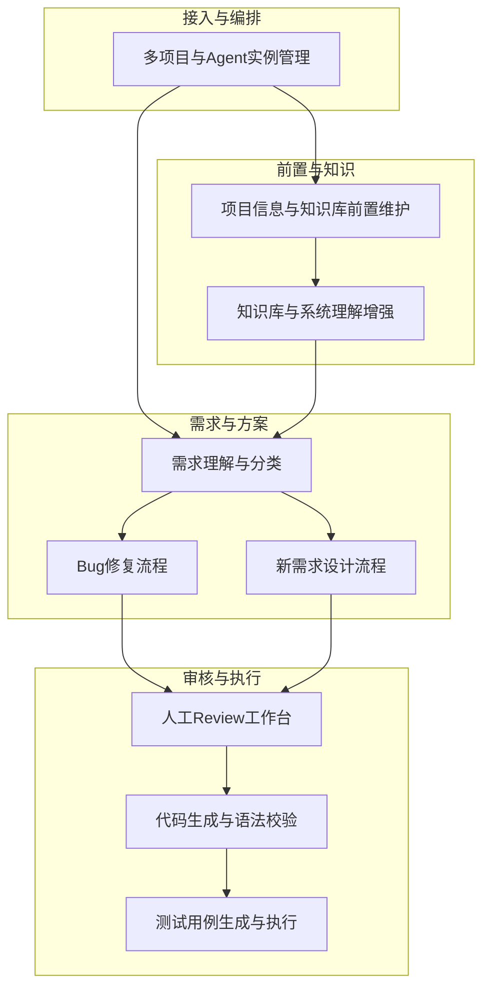
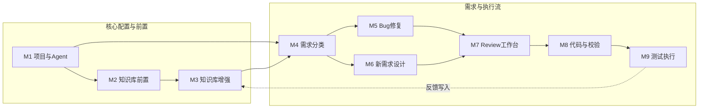

# 运维 Agent 生产系统 - 模块设计文档

本文档基于 [产品设计文档-运维Agent生产系统.md](产品设计文档-运维Agent生产系统.md) 对系统进行模块级设计，明确各模块职责、接口、核心数据与依赖关系，便于开发实现与联调。

---

## 1. 模块总览

系统按业务域划分为以下模块，模块间通过统一工作流与领域事件串联。

| 模块编号 | 模块名称 | 职责概要 |
|----------|----------|----------|
| M1 | 多项目与 Agent 实例管理 | 项目与 Agent 实例的创建、配置、隔离与生命周期 |
| M2 | 项目信息与知识库前置维护 | 项目信息录入、知识库就绪校验、前置拦截 |
| M3 | 知识库与系统理解增强 | 向量检索、代码索引、RAG、反馈写入与更新策略 |
| M4 | 需求理解与分类 | 需求解析、意图识别、Bug/新需求分类与范围分析 |
| M5 | Bug 修复流程 | 问题定位、修复方案生成、与工作流衔接 |
| M6 | 新需求设计流程 | 技术方案/设计稿生成、与工作流衔接 |
| M7 | 人工 Review 工作台 | 待审项展示、通过/驳回、评论与审计 |
| M8 | 代码生成与语法校验 | 代码生成、Linter 集成、语法/静态检查 |
| M9 | 测试用例生成与执行 | 用例生成、测试执行、报告产出与存储 |

---

## 2. M1 - 多项目与 Agent 实例管理

### 2.1 模块职责

- 维护项目元数据（名称、代码库地址、环境、所属团队等）
- 为每个项目创建并配置独立 Agent 实例（模型、Prompt 模板、工具链配置）
- 管理项目与用户/角色的权限关系
- 提供「按项目隔离」的配置查询与下发，供下游模块使用

### 2.2 核心实体

| 实体 | 说明 | 关键字段示例 |
|------|------|--------------|
| Project | 运维项目 | id, name, repoUrl, branch, envType, createdAt |
| AgentInstance | 项目绑定的 Agent 实例 | id, projectId, modelConfig, promptTemplateId, toolchainConfig |
| ProjectMember | 项目成员与角色 | projectId, userId, role: demander/reviewer/admin |

### 2.3 对外接口（示例）

| 接口 | 说明 | 主要入参/出参 |
|------|------|----------------|
| GetProject(projectId) | 获取项目详情 | projectId → Project |
| GetAgentConfig(projectId) | 获取项目 Agent 配置 | projectId → AgentInstance |
| CheckProjectAccess(projectId, userId, action) | 校验用户对项目的操作权限 | projectId, userId, action → allowed |
| ListProjectsByUser(userId) | 用户可见项目列表 | userId → Project[] |

### 2.4 依赖与下游

- **依赖**：用户与权限中心（可选）、代码库与密钥管理
- **下游**：M2（项目信息维护入口）、M4（按项目拉取 Agent 配置与知识库）、工作流引擎（按 projectId 路由任务）

---

## 3. M2 - 项目信息与知识库前置维护

### 3.1 模块职责

- 提供项目信息的录入与编辑（项目概述、架构/目录、关键模块、配置说明、Runbook 等）
- 定义并校验「项目信息就绪」的判定标准（必填项、最小文档集）
- 在需求/Bug 提交入口处执行知识库就绪校验，未就绪则拦截并引导先维护
- 与 M3 协同：写入知识库的元数据与就绪状态由本模块维护或查询

### 3.2 核心实体

| 实体 | 说明 | 关键字段示例 |
|------|------|--------------|
| ProjectProfile | 项目信息档案 | projectId, overview, architectureDoc, directoryDoc, configDoc, runbookDoc, updatedAt |
| KnowledgeReadiness | 知识库就绪状态 | projectId, isReady, requiredChecks[], lastCheckedAt |

### 3.3 就绪判定规则（示例）

- 至少包含：项目概述（overview）、架构或目录说明（architectureDoc 或 directoryDoc）
- 可选：配置说明、Runbook；若启用「最小文档集」策略，可配置必填文档类型列表

### 3.4 对外接口（示例）

| 接口 | 说明 | 主要入参/出参 |
|------|------|----------------|
| SaveProjectProfile(projectId, profile) | 保存/更新项目信息 | projectId, profile → success |
| GetProjectProfile(projectId) | 获取项目信息 | projectId → ProjectProfile |
| CheckKnowledgeReadiness(projectId) | 校验知识库是否就绪 | projectId → isReady, missing[] |
| RequireKnowledgeReady(projectId) | 需求/Bug 提交前调用，未就绪则抛错或返回 4xx + 引导文案 | projectId → void / error |

### 3.5 依赖与下游

- **依赖**：M1（项目存在性）、M3（写入文档、更新向量索引后可更新就绪状态）
- **下游**：需求提交入口（调用 RequireKnowledgeReady）、工作流（创建需求任务前校验）

---

## 4. M3 - 知识库与系统理解增强

### 4.1 模块职责

- 按项目维护独立知识库：文档解析、分块、embedding、写入向量库
- 提供按项目维度的检索接口（RAG），供 Agent 拉取上下文
- 可选：代码库索引（关键目录 chunk + embedding 或 CodeBERT 类检索）
- 变更反馈写入：将本次修复/需求摘要回写知识库，便于后续检索
- 更新策略：MR 合并 webhook、定时任务或手动触发增量/全量索引

### 4.2 核心实体与存储

| 概念 | 说明 |
|------|------|
| 文档条目 | 项目维度；来源：项目信息、上传文件、Runbook、历史 MR 摘要等 |
| 向量索引 | 按 projectId 建 namespace/collection，避免跨项目检索 |
| 代码索引 | 按 projectId + 仓库路径建索引，可选按语言/目录过滤 |

### 4.3 对外接口（示例）

| 接口 | 说明 | 主要入参/出参 |
|------|------|----------------|
| IndexDocument(projectId, docId, content, meta) | 单文档索引 | projectId, docId, content, meta → jobId / success |
| Search(projectId, query, topK) | 语义检索 | projectId, query, topK → hits[] |
| IndexCode(projectId, repoPath, paths[]) | 代码索引（增量/全量） | projectId, repoPath, paths[] → jobId |
| AppendFeedback(projectId, ticketId, summary) | 将本次工单摘要写入知识库 | projectId, ticketId, summary → success |

### 4.4 依赖与下游

- **依赖**：M1（projectId）、向量库与 embedding 服务、代码库只读访问
- **下游**：M4 / M5 / M6（Agent 调用 Search 获取上下文）、M2（索引完成后可更新就绪状态）

---

## 5. M4 - 需求理解与分类

### 5.1 模块职责

- 接收用户输入的运维需求文本（或附件）
- 调用 Agent + 知识库检索，进行意图识别与分类：Bug / 新需求
- 输出结构化结果：类型、简要范围、涉及模块/文件（可选）、置信度
- 将结果写入工单并驱动下游分支：Bug → M5，新需求 → M6

### 5.2 核心实体

| 实体 | 说明 | 关键字段示例 |
|------|------|--------------|
| Ticket | 工单/需求单 | id, projectId, title, description, type: bug/feature, status, createdAt |
| AnalysisResult | 分析结果 | ticketId, type, scopeSummary, affectedModules[], confidence |

### 5.3 对外接口（示例）

| 接口 | 说明 | 主要入参/出参 |
|------|------|----------------|
| AnalyzeDemand(projectId, input) | 执行需求分析与分类 | projectId, input{ text, attachments? } → AnalysisResult |
| CreateTicket(projectId, input, analysisResult) | 创建工单并写入分析结果 | projectId, input, analysisResult → Ticket |

### 5.4 依赖与下游

- **依赖**：M1（Agent 配置）、M3（RAG 检索）、M2（入口处已做知识库就绪校验）
- **下游**：工作流根据 type 触发 M5 或 M6；M7 展示工单与后续方案

---

## 6. M5 - Bug 修复流程

### 6.1 模块职责

- 基于工单与知识库/代码上下文，定位问题并生成修复方案（自然语言 + 涉及文件/位置）
- 输出可供 Review 的修复方案文档，不直接生成代码；代码由 M8 在 Review 通过后生成
- 与工作流衔接：方案就绪 → 进入 M7 Review；Review 通过 → 触发 M8

### 6.2 核心实体

| 实体 | 说明 | 关键字段示例 |
|------|------|--------------|
| FixPlan | 修复方案 | ticketId, rootCauseSummary, changePlan[], suggestedFiles[], createdAt |

### 6.3 对外接口（示例）

| 接口 | 说明 | 主要入参/出参 |
|------|------|----------------|
| GenerateFixPlan(ticketId) | 生成修复方案 | ticketId → FixPlan |

### 6.4 依赖与下游

- **依赖**：M4（工单与分析结果）、M3（检索）、M1（Agent）
- **下游**：M7（展示 FixPlan 供 Review），Review 通过后 M8 根据 FixPlan 生成代码

---

## 7. M6 - 新需求设计流程

### 7.1 模块职责

- 基于工单与知识库/代码上下文，生成技术方案或设计说明（模块划分、接口、数据流、涉及文件建议）
- 输出可供 Review 的设计文档，不直接生成代码；代码由 M8 在 Review 通过后生成
- 与工作流衔接：设计就绪 → 进入 M7 Review；Review 通过 → 触发 M8

### 7.2 核心实体

| 实体 | 说明 | 关键字段示例 |
|------|------|--------------|
| DesignDoc | 设计文档 | ticketId, overview, modules[], interfaces[], suggestedFiles[], createdAt |

### 7.3 对外接口（示例）

| 接口 | 说明 | 主要入参/出参 |
|------|------|----------------|
| GenerateDesign(ticketId) | 生成设计文档 | ticketId → DesignDoc |

### 7.4 依赖与下游

- **依赖**：M4（工单与分析结果）、M3（检索）、M1（Agent）
- **下游**：M7（展示 DesignDoc 供 Review），Review 通过后 M8 根据 DesignDoc 生成代码

---

## 8. M7 - 人工 Review 工作台

### 8.1 模块职责

- 汇总待 Review 项：方案（FixPlan/DesignDoc）、代码变更（由 M8 生成后）、测试结果摘要（由 M9 产出后，可选二次 Review）
- 提供通过/驳回操作，驳回时需填写意见并回退到对应环节（方案修改或代码修改）
- 记录审计日志：谁、何时、对哪条工单/哪一版做了通过或驳回
- 与工作流衔接：创建「用户任务」或「信号」节点，Review 通过后触发下游（如 M8 或 M9）

### 8.2 核心实体

| 实体 | 说明 | 关键字段示例 |
|------|------|--------------|
| ReviewTask | 待审任务 | id, ticketId, type: plan/code/testReport, targetId, status: pending/approved/rejected |
| ReviewRecord | 审计记录 | reviewTaskId, operatorId, action: approve/reject, comment, createdAt |

### 8.3 对外接口（示例）

| 接口 | 说明 | 主要入参/出参 |
|------|------|----------------|
| ListPendingReviews(projectId, userId?) | 待审列表 | projectId, userId? → ReviewTask[] |
| SubmitReview(reviewTaskId, action, comment) | 提交通过/驳回 | reviewTaskId, action, comment → success |
| GetReviewHistory(ticketId) | 工单的 Review 历史 | ticketId → ReviewRecord[] |

### 8.4 依赖与下游

- **依赖**：M5/M6（方案）、M8（代码变更与语法检查结果）、M9（测试报告）、M1（权限）
- **下游**：工作流（根据 Review 结果推进或回退）；M8 仅在「方案/代码 Review 通过」后被触发

---

## 9. M8 - 代码生成与语法校验

### 9.1 模块职责

- 在 Review 通过后，根据 FixPlan 或 DesignDoc 生成代码（补丁或新文件）
- 调用项目配置的 Linter/静态检查工具，对生成结果做语法与静态检查
- 检查不通过时产出可读结果（错误行号、说明），支持重新生成或人工修改后再次校验
- 检查通过后，将代码变更与检查结果落库，并触发 M9 测试

### 9.2 核心实体

| 实体 | 说明 | 关键字段示例 |
|------|------|--------------|
| CodeChange | 代码变更 | ticketId, patchOrFiles[], linterResult, status: pending/passed/failed |
| LinterResult | 检查结果 | codeChangeId, tool, errors[], warnings[], passed |

### 9.3 对外接口（示例）

| 接口 | 说明 | 主要入参/出参 |
|------|------|----------------|
| GenerateCode(ticketId) | 根据方案/设计生成代码 | ticketId → CodeChange |
| RunLinter(projectId, codeChangeId) | 执行语法/静态检查 | projectId, codeChangeId → LinterResult |
| GetCodeChange(ticketId) | 获取当前工单最新代码变更 | ticketId → CodeChange |

### 9.4 依赖与下游

- **依赖**：M5/M6（方案与设计）、M7（Review 状态）、M1（项目与工具链配置）、Linter 服务
- **下游**：M9（测试基于通过检查的代码变更）、M7（代码与检查结果作为 Review 对象）

---

## 10. M9 - 测试用例生成与执行

### 10.1 模块职责

- 根据工单类型、方案/设计与代码变更，自动生成测试用例（脚本或用例描述）
- 在隔离环境（Docker/CI Runner）中执行测试，采集统一格式报告（如 JUnit XML）
- 解析报告并落库，生成测试报告摘要（通过率、失败用例、日志链接）
- 测试失败时支持重新修复后再次触发执行；测试通过后可进入发布/反馈环节

### 10.2 核心实体

| 实体 | 说明 | 关键字段示例 |
|------|------|--------------|
| TestRun | 一次测试执行 | ticketId, codeChangeId, status: running/passed/failed, startedAt, finishedAt |
| TestReport | 测试报告 | testRunId, summary, totalCount, passedCount, failedCount, rawReportUrl |

### 10.3 对外接口（示例）

| 接口 | 说明 | 主要入参/出参 |
|------|------|----------------|
| GenerateTestCases(ticketId, codeChangeId) | 生成测试用例 | ticketId, codeChangeId → testCaseSpec[] |
| RunTests(projectId, ticketId, codeChangeId) | 执行测试并写入报告 | projectId, ticketId, codeChangeId → TestRun |
| GetTestReport(testRunId) | 获取测试报告 | testRunId → TestReport |

### 10.4 依赖与下游

- **依赖**：M8（代码变更）、M1（项目与执行环境配置）、测试执行服务与报告解析
- **下游**：M7（可选：测试报告二次 Review）、发布/部署流程；M3（可选：将本次修复/需求摘要 AppendFeedback 写入知识库）

---

## 11. 模块依赖关系图（Mermaid）

---

## 12. 数据流与工作流衔接要点

- **工单（Ticket）** 为贯穿 M4～M9 的主线实体，projectId + ticketId 唯一确定一条需求/Bug 的完整流水线。
- **状态机**：工单状态建议包含但不限于：created → analyzed → plan_ready → plan_review_pending → plan_review_passed → code_generated → lint_passed → test_passed → released / 以及各环节的 rejected 或 failed 状态，便于工作流引擎与前端展示。
- **事件**：各模块在关键节点可发出领域事件（如 TicketAnalyzed、PlanReady、ReviewApproved、LintPassed、TestPassed），由工作流或消息队列消费，驱动下一环节，便于解耦与扩展。

以上模块设计可直接作为开发拆分任务与接口契约的依据，并与 [产品设计文档-运维Agent生产系统.md](产品设计文档-运维Agent生产系统.md) 中的流程与架构保持一致。
